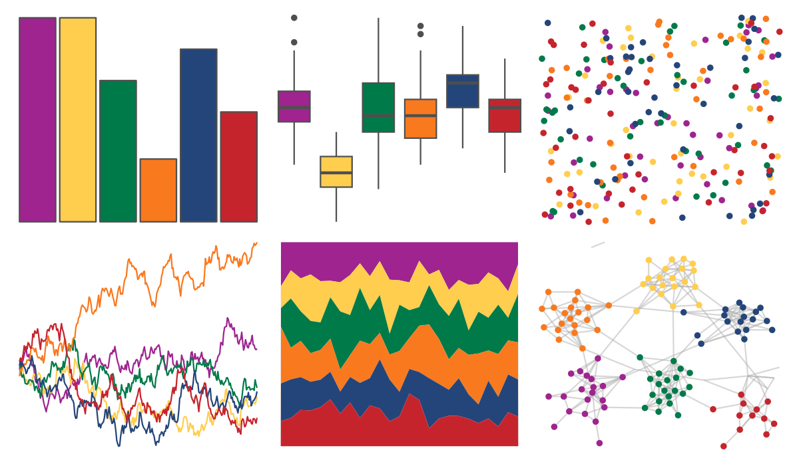
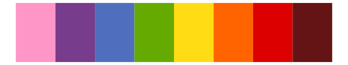

# awtools - spalette 

::: columns
::: {.column width="50%"}

**Github**

[awhstin/awtools](https://github.com/awhstin/awtools)
:::

::: {.column width="50%"}

**CRAN**

Not on CRAN
:::
:::

<hr> 

Use with [paletteer](https://emilhvitfeldt.github.io/paletteer/) package:

```r
library(paletteer)
paletteer_d("awtools::spalette")
```

Use raw:

```r
c("#9F248FFF", "#FFCE4EFF", "#017A4AFF", "#F9791EFF", "#244579FF", "#C6242DFF")
``` 

 

<br>

# Related Palettes

<div class="list" style="display: grid; grid-template-columns: auto auto auto;"> <figure class="figure">
<a href="../../awtools/a_palette/"> </a>
</figure> <figure class="figure">
<a href="../../ButterflyColors/hamadryas_feronia/"> </a>
</figure> <figure class="figure">
<a href="../../ButterflyColors/hamadryas_feronia/"> </a>
</figure> <figure class="figure">
<a href="../../RSkittleBrewer/smarties/"> </a>
</figure> <figure class="figure">
<a href="../../MetBrewer/Juarez/"> </a>
</figure> <figure class="figure">
<a href="../../khroma/mediumcontrast/"> </a>
</figure> <figure class="figure">
<a href="../../MoMAColors/OKeeffe/"> </a>
</figure> <figure class="figure">
<a href="../../fishualize/Clepticus_brasiliensis/"> </a>
</figure> <figure class="figure">
<a href="../../ggthemes/excel_Slice/"> </a>
</figure> <figure class="figure">
<a href="../../MetBrewer/Cross/"> </a>
</figure> <figure class="figure">
<a href="../../nationalparkcolors/Saguaro/"> </a>
</figure> <figure class="figure">
<a href="../../MetBrewer/Archambault/"> </a>
</figure> 
</div>
