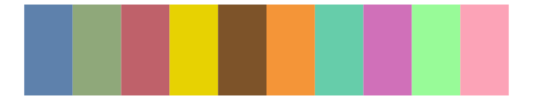
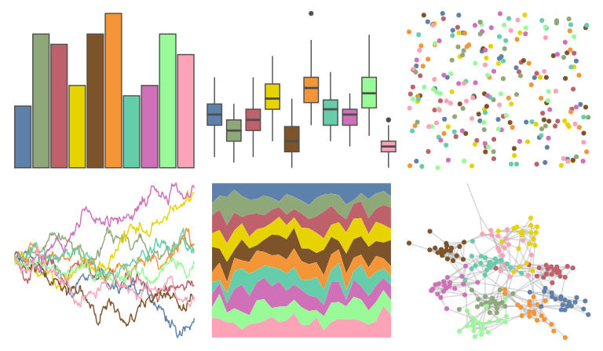
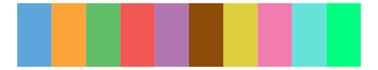
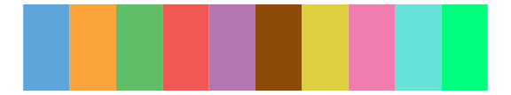
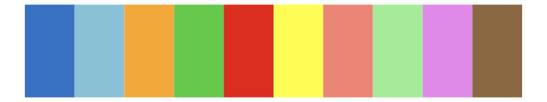
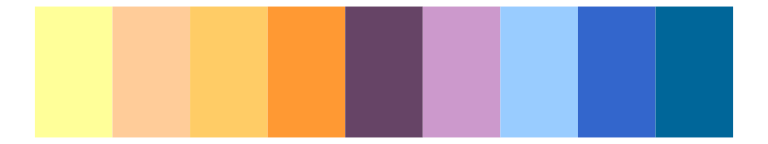

# basetheme - brutal 

::: columns
::: {.column width="50%"}

**Github**

[karoliskoncevicius/basetheme](https://github.com/karoliskoncevicius/basetheme)
:::

::: {.column width="50%"}

**CRAN**

[basetheme](https://CRAN.R-project.org/package=basetheme)
:::
:::

<hr> 

Use with [paletteer](https://emilhvitfeldt.github.io/paletteer/) package:

```r
library(paletteer)
paletteer_d("basetheme::brutal")
```

Use raw:

```r
c("#5E81ACFF", "#8FA87AFF", "#BF616AFF", "#E7D202FF", "#7D5329FF", "#F49538FF", "#66CDAAFF", "#D070B9FF", "#98FB98FF", "#FCA3B7FF")
``` 

 

<br>

# Related Palettes

<div class="list" style="display: grid; grid-template-columns: auto auto auto;"> <figure class="figure">
<a href="../../awtools/a_palette/"> </a>
</figure> <figure class="figure">
<a href="../../basetheme/minimal/"> </a>
</figure> <figure class="figure">
<a href="../../basetheme/void/"> </a>
</figure> <figure class="figure">
<a href="../../basetheme/clean/"> </a>
</figure> <figure class="figure">
<a href="../../basetheme/dark/"> </a>
</figure> <figure class="figure">
<a href="../../ggthemes/few_Medium/"> </a>
</figure> <figure class="figure">
<a href="../../ggthemr/flat_dark/"> </a>
</figure> <figure class="figure">
<a href="../../trekcolors/lcars_2357/"> </a>
</figure> <figure class="figure">
<a href="../../feathers/rose_crowned_fruit_dove/"> </a>
</figure> <figure class="figure">
<a href="../../ggsci/schwifty_rickandmorty/"> </a>
</figure> <figure class="figure">
<a href="../../RColorBrewer/Accent/"> </a>
</figure> <figure class="figure">
<a href="../../peRReo/calle13/"> </a>
</figure> 
</div>
