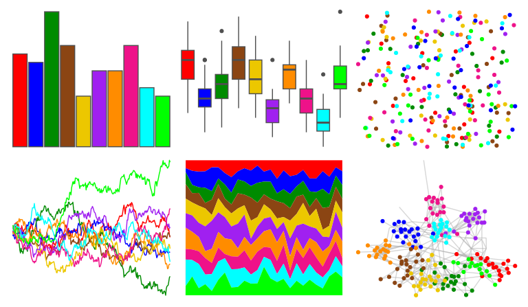

# basetheme - ink 

::: columns
::: {.column width="50%"}

**Github**

[karoliskoncevicius/basetheme](https://github.com/karoliskoncevicius/basetheme)
:::

::: {.column width="50%"}

**CRAN**

[basetheme](https://CRAN.R-project.org/package=basetheme)
:::
:::

<hr> 

Use with [paletteer](https://emilhvitfeldt.github.io/paletteer/) package:

```r
library(paletteer)
paletteer_d("basetheme::ink")
```

Use raw:

```r
c("#FF0000FF", "#0000FFFF", "#008B00FF", "#8B4513FF", "#ECC700FF", "#A020F0FF", "#FF8C00FF", "#EE1289FF", "#00FFFFFF", "#00FF00FF")
``` 

 

<br>

# Related Palettes

<div class="list" style="display: grid; grid-template-columns: auto auto auto;"> <figure class="figure">
<a href="../../awtools/a_palette/"> </a>
</figure> <figure class="figure">
<a href="../../jcolors/rainbow/"> </a>
</figure> <figure class="figure">
<a href="../../Redmonder/qMSOStd/"> </a>
</figure> <figure class="figure">
<a href="../../basetheme/deepblue/"> </a>
</figure> <figure class="figure">
<a href="../../ggprism/stained_glass/"> </a>
</figure> <figure class="figure">
<a href="../../trekcolors/lcars_23c/"> </a>
</figure> <figure class="figure">
<a href="../../jcolors/pal3/"> </a>
</figure> <figure class="figure">
<a href="../../ggthemr/flat/"> </a>
</figure> <figure class="figure">
<a href="../../miscpalettes/semiTransparent/"> </a>
</figure> <figure class="figure">
<a href="../../tidyquant/tq_dark/"> </a>
</figure> <figure class="figure">
<a href="../../ggprism/stained_glass2/"> </a>
</figure> <figure class="figure">
<a href="../../yarrr/basel/"> </a>
</figure> 
</div>
