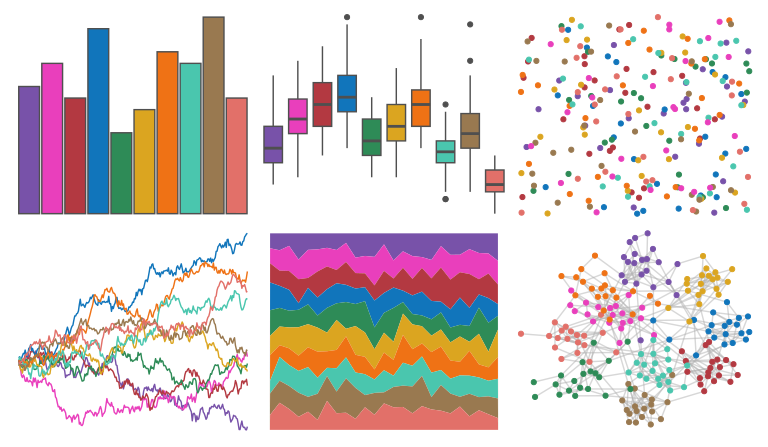

# basetheme - royal 

::: columns
::: {.column width="50%"}

**Github**

[karoliskoncevicius/basetheme](https://github.com/karoliskoncevicius/basetheme)
:::

::: {.column width="50%"}

**CRAN**

[basetheme](https://CRAN.R-project.org/package=basetheme)
:::
:::

<hr> 

Use with [paletteer](https://emilhvitfeldt.github.io/paletteer/) package:

```r
library(paletteer)
paletteer_d("basetheme::royal")
```

Use raw:

```r
c("#7852A9FF", "#E93FBCFF", "#B33941FF", "#1175BBFF", "#2E8B57FF", "#DBA520FF", "#EF7215FF", "#4AC6AEFF", "#997950FF", "#E27069FF")
``` 

 

<br>

# Related Palettes

<div class="list" style="display: grid; grid-template-columns: auto auto auto;"> <figure class="figure">
<a href="../../awtools/a_palette/"> </a>
</figure> <figure class="figure">
<a href="../../ggsci/category10_d3/"> </a>
</figure> <figure class="figure">
<a href="../../ggthemes/Classic_10/"> </a>
</figure> <figure class="figure">
<a href="../../ggsci/default_nejm/"> </a>
</figure> <figure class="figure">
<a href="../../rcartocolor/Vivid/"> </a>
</figure> <figure class="figure">
<a href="../../rcartocolor/Bold/"> </a>
</figure> <figure class="figure">
<a href="../../MetBrewer/Cross/"> </a>
</figure> <figure class="figure">
<a href="../../ggthemes/excel_Ion/"> </a>
</figure> <figure class="figure">
<a href="../../ggthemr/flat/"> </a>
</figure> <figure class="figure">
<a href="../../ggthemes/Classic_Cyclic/"> </a>
</figure> <figure class="figure">
<a href="../../Redmonder/qPBI/"> </a>
</figure> <figure class="figure">
<a href="../../ggthemes/excel_Celestial/"> </a>
</figure> 
</div>
