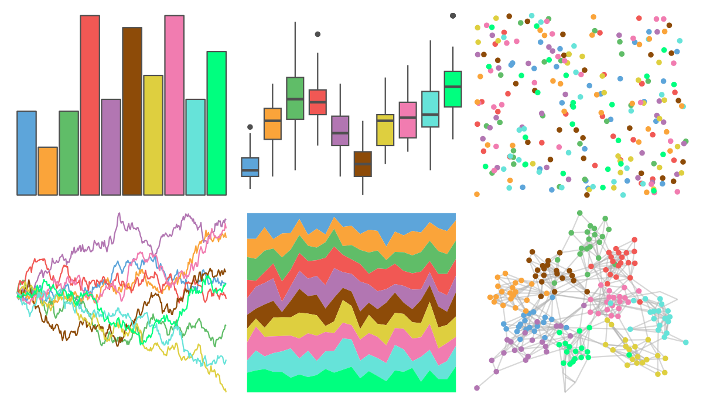

# basetheme - void 

::: columns
::: {.column width="50%"}

**Github**

[karoliskoncevicius/basetheme](https://github.com/karoliskoncevicius/basetheme)
:::

::: {.column width="50%"}

**CRAN**

[basetheme](https://CRAN.R-project.org/package=basetheme)
:::
:::

<hr> 

Use with [paletteer](https://emilhvitfeldt.github.io/paletteer/) package:

```r
library(paletteer)
paletteer_d("basetheme::void")
```

Use raw:

```r
c("#5DA5DAFF", "#FAA43AFF", "#60BD68FF", "#F15854FF", "#B276B2FF", "#8D4B08FF", "#DECF3FFF", "#F17CB0FF", "#66E3D9FF", "#00FF7FFF")
``` 

 

<br>

# Related Palettes

<div class="list" style="display: grid; grid-template-columns: auto auto auto;"> <figure class="figure">
<a href="../../awtools/a_palette/"> </a>
</figure> <figure class="figure">
<a href="../../basetheme/clean/"> </a>
</figure> <figure class="figure">
<a href="../../basetheme/minimal/"> </a>
</figure> <figure class="figure">
<a href="../../basetheme/brutal/"> </a>
</figure> <figure class="figure">
<a href="../../basetheme/dark/"> </a>
</figure> <figure class="figure">
<a href="../../ggsci/schwifty_rickandmorty/"> </a>
</figure> <figure class="figure">
<a href="../../tvthemes/rickAndMorty/"> </a>
</figure> <figure class="figure">
<a href="../../tidyquant/tq_dark/"> </a>
</figure> <figure class="figure">
<a href="../../ggthemr/flat_dark/"> </a>
</figure> <figure class="figure">
<a href="../../peRReo/calle13/"> </a>
</figure> <figure class="figure">
<a href="../../ggthemes/hc_default/"> </a>
</figure> <figure class="figure">
<a href="../../ggthemr/flat/"> </a>
</figure> 
</div>
