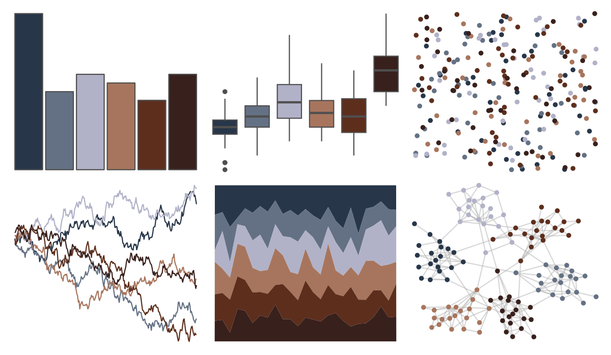

# beyonce - X1 

::: columns
::: {.column width="50%"}

**Github**

[dill/beyonce](https://github.com/dill/beyonce)
:::

::: {.column width="50%"}

**CRAN**

Not on CRAN
:::
:::

<hr> 

Use with [paletteer](https://emilhvitfeldt.github.io/paletteer/) package:

```r
library(paletteer)
paletteer_d("beyonce::X1")
```

Use raw:

```r
c("#273649FF", "#647184FF", "#B1B2C8FF", "#A7755DFF", "#5D2E1CFF", "#38201CFF")
``` 

 

<br>

# Related Palettes

<div class="list" style="display: grid; grid-template-columns: auto auto auto;"> <figure class="figure">
<a href="../../amerika/Dem_Ind_Rep3/"> </a>
</figure> <figure class="figure">
<a href="../../colRoz/c_azureus/"> </a>
</figure> <figure class="figure">
<a href="../../yarrr/usualsuspects/"> </a>
</figure> <figure class="figure">
<a href="../../ghibli/TotoroMedium/"> </a>
</figure> <figure class="figure">
<a href="../../MoMAColors/Picasso/"> </a>
</figure> <figure class="figure">
<a href="../../colRoz/t_australis/"> </a>
</figure> <figure class="figure">
<a href="../../lisa/Masaccio/"> </a>
</figure> <figure class="figure">
<a href="../../ggthemr/sky/"> </a>
</figure> <figure class="figure">
<a href="../../calecopal/tidepool/"> </a>
</figure> <figure class="figure">
<a href="../../colRoz/capricorn/"> </a>
</figure> <figure class="figure">
<a href="../../beyonce/X38/"> </a>
</figure> <figure class="figure">
<a href="../../nord/lake_superior/"> </a>
</figure> 
</div>
