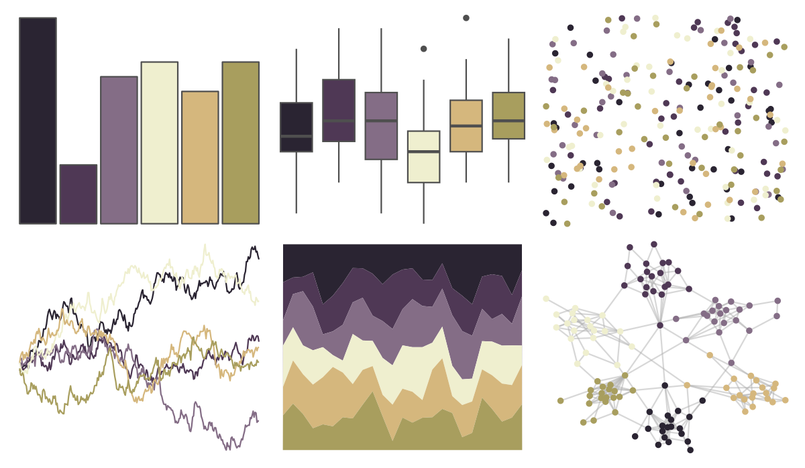

# beyonce - X10 

::: columns
::: {.column width="50%"}

**Github**

[dill/beyonce](https://github.com/dill/beyonce)
:::

::: {.column width="50%"}

**CRAN**

Not on CRAN
:::
:::

<hr> 

Use with [paletteer](https://emilhvitfeldt.github.io/paletteer/) package:

```r
library(paletteer)
paletteer_d("beyonce::X10")
```

Use raw:

```r
c("#2A2432FF", "#4F3855FF", "#846D86FF", "#EFEFCFFF", "#D5B77DFF", "#A89E5EFF")
``` 

 

<br>

# Related Palettes

<div class="list" style="display: grid; grid-template-columns: auto auto auto;"> <figure class="figure">
<a href="../../amerika/Dem_Ind_Rep3/"> </a>
</figure> <figure class="figure">
<a href="../../colRoz/spinifex/"> </a>
</figure> <figure class="figure">
<a href="../../lisa/KatsushikaHokusai/"> </a>
</figure> <figure class="figure">
<a href="../../fishualize/Sander_lucioperca/"> </a>
</figure> <figure class="figure">
<a href="../../calecopal/caqu/"> </a>
</figure> <figure class="figure">
<a href="../../lisa/JoanMiro/"> </a>
</figure> <figure class="figure">
<a href="../../IslamicArt/alhambra/"> </a>
</figure> <figure class="figure">
<a href="../../colRoz/e_kingii/"> </a>
</figure> <figure class="figure">
<a href="../../wesanderson/IsleofDogs2/"> </a>
</figure> <figure class="figure">
<a href="../../lisa/EdouardManet/"> </a>
</figure> <figure class="figure">
<a href="../../calecopal/buow/"> </a>
</figure> <figure class="figure">
<a href="../../calecopal/coastaldune2/"> </a>
</figure> 
</div>
