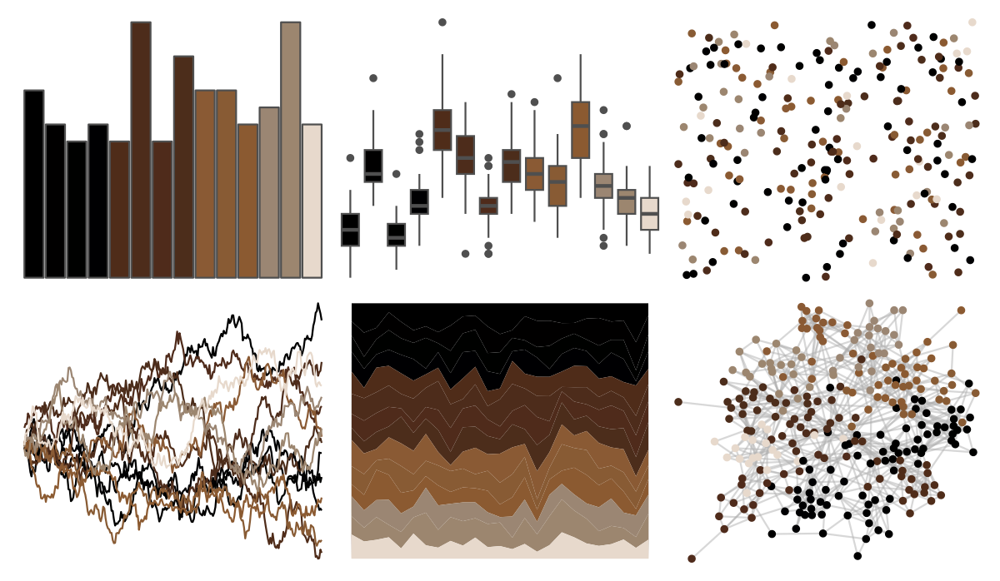
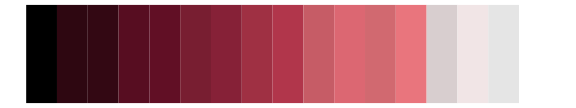

# beyonce - X100 

::: columns
::: {.column width="50%"}

**Github**

[dill/beyonce](https://github.com/dill/beyonce)
:::

::: {.column width="50%"}

**CRAN**

Not on CRAN
:::
:::

<hr> 

Use with [paletteer](https://emilhvitfeldt.github.io/paletteer/) package:

```r
library(paletteer)
paletteer_d("beyonce::X100")
```

Use raw:

```r
c("#000000FF", "#010000FF", "#000100FF", "#000002FF", "#4F2C19FF", "#4D2C1BFF", "#4F2B1BFF", "#4C2D1BFF", "#8A5A34FF", "#885B34FF", "#8B5A31FF", "#9B8673FF", "#9C866FFF", "#E7D9CCFF")
``` 

 

<br>

# Related Palettes

<div class="list" style="display: grid; grid-template-columns: auto auto auto;"> <figure class="figure">
<a href="../../awtools/a_palette/"> </a>
</figure> <figure class="figure">
<a href="../../ButterflyColors/hamadryas_feronia/"> </a>
</figure> <figure class="figure">
<a href="../../ButterflyColors/hamadryas_feronia/"> </a>
</figure> <figure class="figure">
<a href="../../beyonce/X67/"> </a>
</figure> <figure class="figure">
<a href="../../beyonce/X118/"> </a>
</figure> <figure class="figure">
<a href="../../peRReo/don/"> </a>
</figure> <figure class="figure">
<a href="../../MexBrewer/Aurora/"> </a>
</figure> <figure class="figure">
<a href="../../MexBrewer/Tierra/"> </a>
</figure> <figure class="figure">
<a href="../../ggprism/greenwash/"> </a>
</figure> <figure class="figure">
<a href="../../dutchmasters/staalmeesters/"> </a>
</figure> <figure class="figure">
<a href="../../beyonce/X71/"> </a>
</figure> <figure class="figure">
<a href="../../beyonce/X113/"> </a>
</figure> 
</div>
