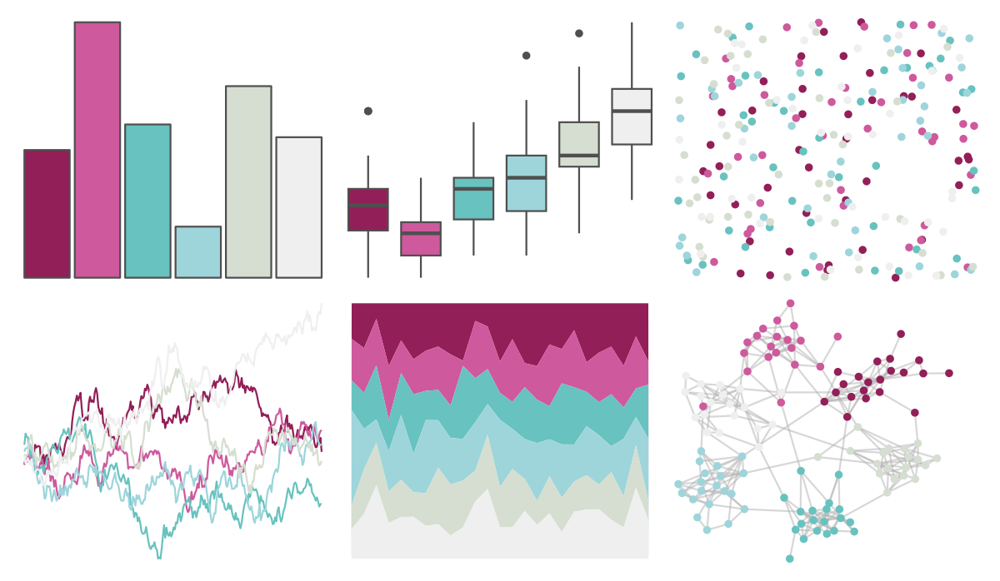

# beyonce - X101 

::: columns
::: {.column width="50%"}

**Github**

[dill/beyonce](https://github.com/dill/beyonce)
:::

::: {.column width="50%"}

**CRAN**

Not on CRAN
:::
:::

<hr> 

Use with [paletteer](https://emilhvitfeldt.github.io/paletteer/) package:

```r
library(paletteer)
paletteer_d("beyonce::X101")
```

Use raw:

```r
c("#921F58FF", "#CE599DFF", "#68C2BFFF", "#9DD5DBFF", "#D5DED0FF", "#EFEFEFFF")
``` 

 

<br>

# Related Palettes

<div class="list" style="display: grid; grid-template-columns: auto auto auto;"> <figure class="figure">
<a href="../../amerika/Dem_Ind_Rep3/"> </a>
</figure> <figure class="figure">
<a href="../../rcartocolor/Tropic/"> </a>
</figure> <figure class="figure">
<a href="../../palettetown/aerodactyl/"> </a>
</figure> <figure class="figure">
<a href="../../beyonce/X11/"> </a>
</figure> <figure class="figure">
<a href="../../nord/afternoon_prarie/"> </a>
</figure> <figure class="figure">
<a href="../../khroma/PRGn/"> </a>
</figure> <figure class="figure">
<a href="../../musculusColors/Bmsurface/"> </a>
</figure> <figure class="figure">
<a href="../../palettetown/steelix/"> </a>
</figure> <figure class="figure">
<a href="../../palettetown/grimer/"> </a>
</figure> <figure class="figure">
<a href="../../MetBrewer/Monet/"> </a>
</figure> <figure class="figure">
<a href="../../palettetown/remoraid/"> </a>
</figure> <figure class="figure">
<a href="../../Redmonder/dPBIPuGn/"> </a>
</figure> 
</div>
