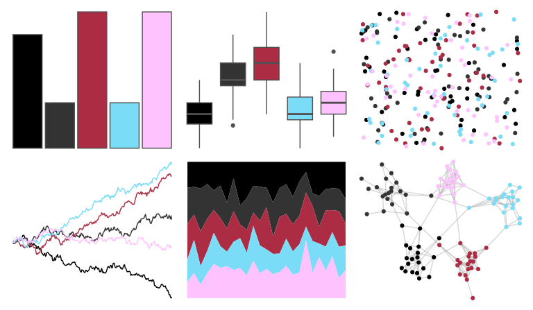

# beyonce - X104 

::: columns
::: {.column width="50%"}

**Github**

[dill/beyonce](https://github.com/dill/beyonce)
:::

::: {.column width="50%"}

**CRAN**

Not on CRAN
:::
:::

<hr> 

Use with [paletteer](https://emilhvitfeldt.github.io/paletteer/) package:

```r
library(paletteer)
paletteer_d("beyonce::X104")
```

Use raw:

```r
c("#000000FF", "#333333FF", "#AB2C43FF", "#7ADCF6FF", "#FEC3FFFF")
``` 

 

<br>

# Related Palettes

<div class="list" style="display: grid; grid-template-columns: auto auto auto;"> <figure class="figure">
<a href="../../awtools/a_palette/"> </a>
</figure> <figure class="figure">
<a href="../../beyonce/X121/"> </a>
</figure> <figure class="figure">
<a href="../../vapoRwave/macPlus/"> </a>
</figure> <figure class="figure">
<a href="../../vapeplot/macplus/"> </a>
</figure> <figure class="figure">
<a href="../../lisa/AndyWarhol_2/"> </a>
</figure> <figure class="figure">
<a href="../../beyonce/X107/"> </a>
</figure> <figure class="figure">
<a href="../../tvthemes/Spinel/"> </a>
</figure> <figure class="figure">
<a href="../../beyonce/X123/"> </a>
</figure> <figure class="figure">
<a href="../../suffrager/hanwell/"> </a>
</figure> <figure class="figure">
<a href="../../LaCroixColoR/Berry/"> </a>
</figure> <figure class="figure">
<a href="../../ghibli/KikiMedium/"> </a>
</figure> <figure class="figure">
<a href="../../futurevisions/jupiter/"> </a>
</figure> 
</div>
