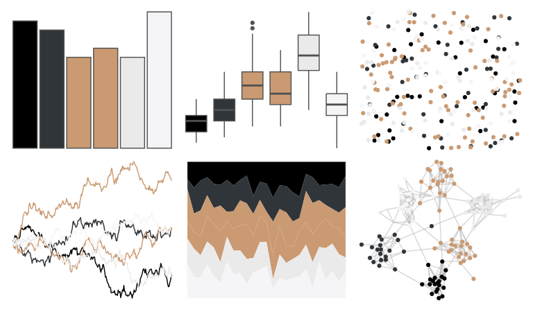

# beyonce - X105 

::: columns
::: {.column width="50%"}

**Github**

[dill/beyonce](https://github.com/dill/beyonce)
:::

::: {.column width="50%"}

**CRAN**

Not on CRAN
:::
:::

<hr> 

Use with [paletteer](https://emilhvitfeldt.github.io/paletteer/) package:

```r
library(paletteer)
paletteer_d("beyonce::X105")
```

Use raw:

```r
c("#000000FF", "#303539FF", "#CA9A72FF", "#CB9A72FF", "#EAEAEAFF", "#F5F5F7FF")
``` 

 

<br>

# Related Palettes

<div class="list" style="display: grid; grid-template-columns: auto auto auto;"> <figure class="figure">
<a href="../../awtools/a_palette/"> </a>
</figure> <figure class="figure">
<a href="../../beyonce/X10/"> </a>
</figure> <figure class="figure">
<a href="../../lisa/KatsushikaHokusai/"> </a>
</figure> <figure class="figure">
<a href="../../wesanderson/IsleofDogs2/"> </a>
</figure> <figure class="figure">
<a href="../../beyonce/X128/"> </a>
</figure> <figure class="figure">
<a href="../../fishualize/Sander_lucioperca/"> </a>
</figure> <figure class="figure">
<a href="../../fishualize/Semicossyphus_pulcher/"> </a>
</figure> <figure class="figure">
<a href="../../trekcolors/terran/"> </a>
</figure> <figure class="figure">
<a href="../../beyonce/X85/"> </a>
</figure> <figure class="figure">
<a href="../../colRoz/e_kingii/"> </a>
</figure> <figure class="figure">
<a href="../../colRoz/n_levis/"> </a>
</figure> <figure class="figure">
<a href="../../ochRe/winmar/"> </a>
</figure> 
</div>
