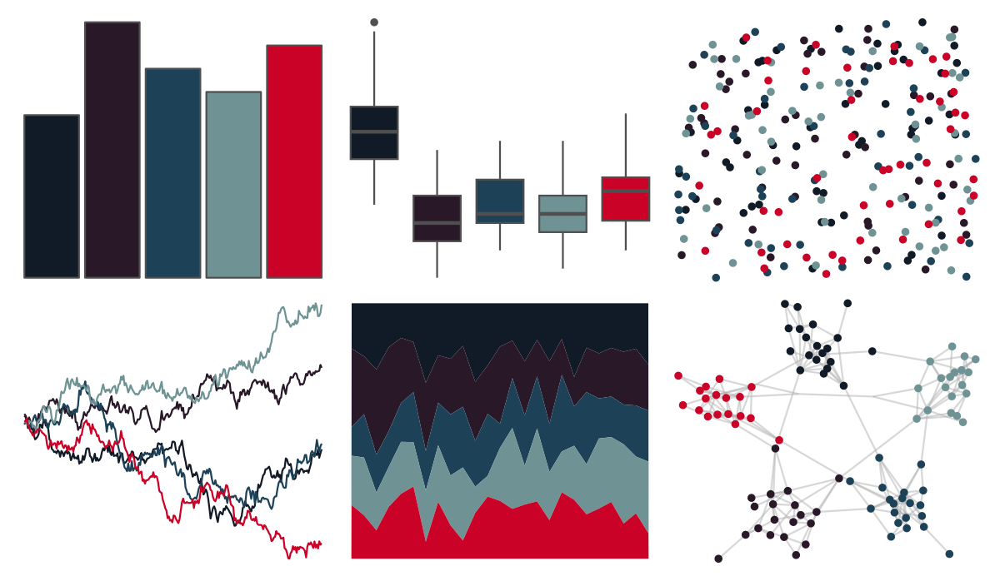

# beyonce - X106 

::: columns
::: {.column width="50%"}

**Github**

[dill/beyonce](https://github.com/dill/beyonce)
:::

::: {.column width="50%"}

**CRAN**

Not on CRAN
:::
:::

<hr> 

Use with [paletteer](https://emilhvitfeldt.github.io/paletteer/) package:

```r
library(paletteer)
paletteer_d("beyonce::X106")
```

Use raw:

```r
c("#111A27FF", "#291828FF", "#1D4258FF", "#6F9394FF", "#CB0227FF")
``` 

 

<br>

# Related Palettes

<div class="list" style="display: grid; grid-template-columns: auto auto auto;"> <figure class="figure">
<a href="../../awtools/a_palette/"> </a>
</figure> <figure class="figure">
<a href="../../nbapalettes/rockets_90s/"> </a>
</figure> <figure class="figure">
<a href="../../MetBrewer/Troy/"> </a>
</figure> <figure class="figure">
<a href="../../nbapalettes/pistons/"> </a>
</figure> <figure class="figure">
<a href="../../nbapalettes/pistons_city/"> </a>
</figure> <figure class="figure">
<a href="../../yarrr/eternal/"> </a>
</figure> <figure class="figure">
<a href="../../nbapalettes/timberwolves_statement/"> </a>
</figure> <figure class="figure">
<a href="../../nbapalettes/kings_city/"> </a>
</figure> <figure class="figure">
<a href="../../nbapalettes/bobcats/"> </a>
</figure> <figure class="figure">
<a href="../../nbapalettes/kings_alt/"> </a>
</figure> <figure class="figure">
<a href="../../beyonce/X68/"> </a>
</figure> <figure class="figure">
<a href="../../unikn/pal_unikn_dark/"> </a>
</figure> 
</div>
