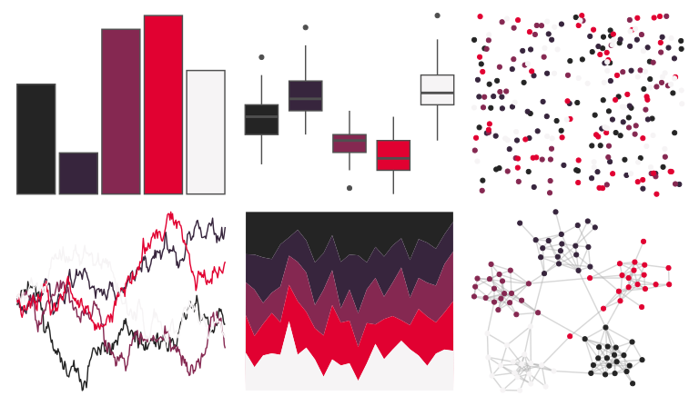

# beyonce - X107 

::: columns
::: {.column width="50%"}

**Github**

[dill/beyonce](https://github.com/dill/beyonce)
:::

::: {.column width="50%"}

**CRAN**

Not on CRAN
:::
:::

<hr> 

Use with [paletteer](https://emilhvitfeldt.github.io/paletteer/) package:

```r
library(paletteer)
paletteer_d("beyonce::X107")
```

Use raw:

```r
c("#242424FF", "#37253DFF", "#852851FF", "#E10131FF", "#F6F4F5FF")
``` 

 

<br>

# Related Palettes

<div class="list" style="display: grid; grid-template-columns: auto auto auto;"> <figure class="figure">
<a href="../../awtools/a_palette/"> </a>
</figure> <figure class="figure">
<a href="../../futurevisions/enceladus/"> </a>
</figure> <figure class="figure">
<a href="../../nbapalettes/pistons/"> </a>
</figure> <figure class="figure">
<a href="../../nbapalettes/pistons_city/"> </a>
</figure> <figure class="figure">
<a href="../../tvthemes/Spinel/"> </a>
</figure> <figure class="figure">
<a href="../../nbapalettes/wizards_earned/"> </a>
</figure> <figure class="figure">
<a href="../../lisa/AndyWarhol_2/"> </a>
</figure> <figure class="figure">
<a href="../../beyonce/X30/"> </a>
</figure> <figure class="figure">
<a href="../../beyonce/X130/"> </a>
</figure> <figure class="figure">
<a href="../../tvthemes/Sardonyx/"> </a>
</figure> <figure class="figure">
<a href="../../DresdenColor/briefcases/"> </a>
</figure> <figure class="figure">
<a href="../../beyonce/X123/"> </a>
</figure> 
</div>
