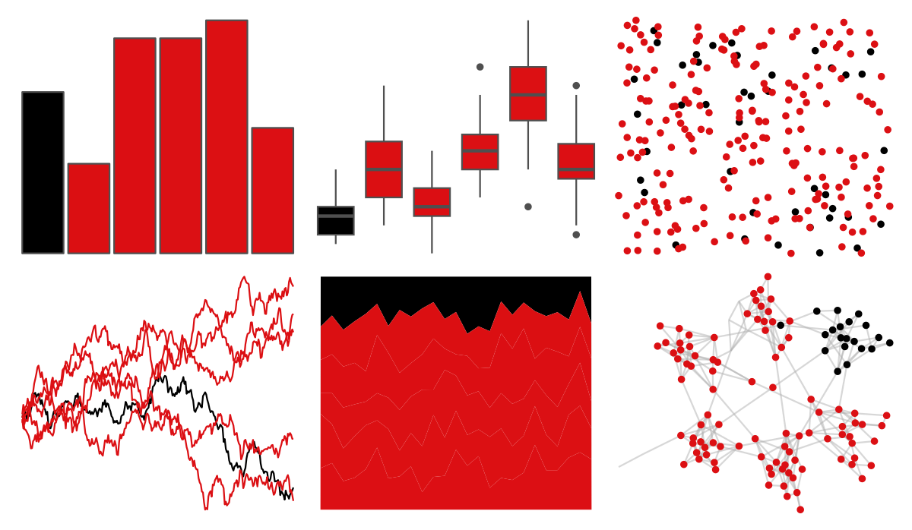

# beyonce - X109 

::: columns
::: {.column width="50%"}

**Github**

[dill/beyonce](https://github.com/dill/beyonce)
:::

::: {.column width="50%"}

**CRAN**

Not on CRAN
:::
:::

<hr> 

Use with [paletteer](https://emilhvitfeldt.github.io/paletteer/) package:

```r
library(paletteer)
paletteer_d("beyonce::X109")
```

Use raw:

```r
c("#000000FF", "#DB0F12FF", "#DB0E13FF", "#DB1014FF", "#DC1013FF", "#DC0F14FF")
``` 

 

<br>

# Related Palettes

<div class="list" style="display: grid; grid-template-columns: auto auto auto;"> <figure class="figure">
<a href="../../amerika/Dem_Ind_Rep3/"> </a>
</figure> <figure class="figure">
<a href="../../nbapalettes/blazers_city2/"> </a>
</figure> <figure class="figure">
<a href="../../fishualize/Heretopriacanthus_cruentatus/"> </a>
</figure> <figure class="figure">
<a href="../../beyonce/X8/"> </a>
</figure> <figure class="figure">
<a href="../../fishualize/Acanthostracion_polygonius_y/"> </a>
</figure> <figure class="figure">
<a href="../../trekcolors/red_alert/"> </a>
</figure> <figure class="figure">
<a href="../../beyonce/X4/"> </a>
</figure> <figure class="figure">
<a href="../../ButterflyColors/fountainea_ryphea/"> </a>
</figure> <figure class="figure">
<a href="../../NineteenEightyR/cobra/"> </a>
</figure> <figure class="figure">
<a href="../../beyonce/X20/"> </a>
</figure> <figure class="figure">
<a href="../../Rdune/fermen2/"> </a>
</figure> <figure class="figure">
<a href="../../calecopal/vermillion/"> </a>
</figure> 
</div>
