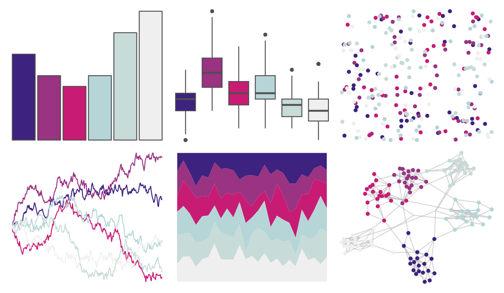

# beyonce - X11 

::: columns
::: {.column width="50%"}

**Github**

[dill/beyonce](https://github.com/dill/beyonce)
:::

::: {.column width="50%"}

**CRAN**

Not on CRAN
:::
:::

<hr> 

Use with [paletteer](https://emilhvitfeldt.github.io/paletteer/) package:

```r
library(paletteer)
paletteer_d("beyonce::X11")
```

Use raw:

```r
c("#3D227FFF", "#993382FF", "#C81B74FF", "#B6D5D7FF", "#C7DBD8FF", "#EFEFEFFF")
``` 

 

<br>

# Related Palettes

<div class="list" style="display: grid; grid-template-columns: auto auto auto;"> <figure class="figure">
<a href="../../awtools/a_palette/"> </a>
</figure> <figure class="figure">
<a href="../../ButterflyColors/hamadryas_feronia/"> </a>
</figure> <figure class="figure">
<a href="../../ButterflyColors/hamadryas_feronia/"> </a>
</figure> <figure class="figure">
<a href="../../palettetown/aerodactyl/"> </a>
</figure> <figure class="figure">
<a href="../../palettetown/wooper/"> </a>
</figure> <figure class="figure">
<a href="../../trekcolors/ufp/"> </a>
</figure> <figure class="figure">
<a href="../../palettetown/zubat/"> </a>
</figure> <figure class="figure">
<a href="../../palettetown/articuno/"> </a>
</figure> <figure class="figure">
<a href="../../palettetown/lugia/"> </a>
</figure> <figure class="figure">
<a href="../../RColorBrewer/Purples/"> </a>
</figure> <figure class="figure">
<a href="../../beyonce/X49/"> </a>
</figure> <figure class="figure">
<a href="../../palettetown/grimer/"> </a>
</figure> 
</div>
