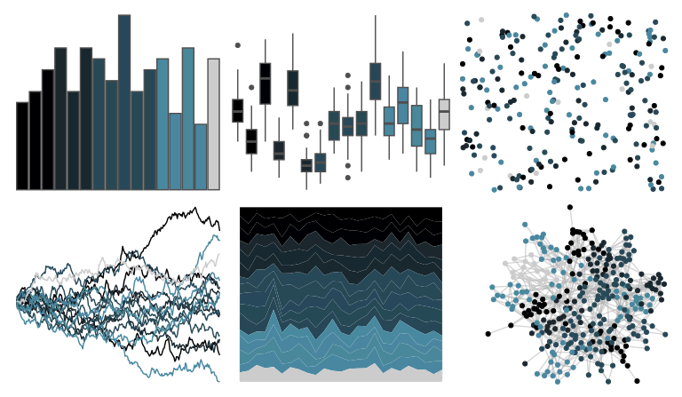

# beyonce - X110 

::: columns
::: {.column width="50%"}

**Github**

[dill/beyonce](https://github.com/dill/beyonce)
:::

::: {.column width="50%"}

**CRAN**

Not on CRAN
:::
:::

<hr> 

Use with [paletteer](https://emilhvitfeldt.github.io/paletteer/) package:

```r
library(paletteer)
paletteer_d("beyonce::X110")
```

Use raw:

```r
c("#000000FF", "#000002FF", "#000104FF", "#1C272DFF", "#172830FF", "#19282FFF", "#274857FF", "#274955FF", "#27485BFF", "#254955FF", "#274756FF", "#48899FFF", "#4A86A0FF", "#49889AFF", "#4987A0FF", "#CCCCCCFF")
``` 

 

<br>

# Related Palettes

<div class="list" style="display: grid; grid-template-columns: auto auto auto;"> <figure class="figure">
<a href="../../awtools/a_palette/"> </a>
</figure> <figure class="figure">
<a href="../../beyonce/X64/"> </a>
</figure> <figure class="figure">
<a href="../../beyonce/X77/"> </a>
</figure> <figure class="figure">
<a href="../../yarrr/eternal/"> </a>
</figure> <figure class="figure">
<a href="../../beyonce/X73/"> </a>
</figure> <figure class="figure">
<a href="../../nord/mountain_forms/"> </a>
</figure> <figure class="figure">
<a href="../../unikn/pal_unikn_dark/"> </a>
</figure> <figure class="figure">
<a href="../../miscpalettes/waterfall/"> </a>
</figure> <figure class="figure">
<a href="../../beyonce/X84/"> </a>
</figure> <figure class="figure">
<a href="../../beyonce/X68/"> </a>
</figure> <figure class="figure">
<a href="../../beyonce/X15/"> </a>
</figure> <figure class="figure">
<a href="../../beyonce/X67/"> </a>
</figure> 
</div>
