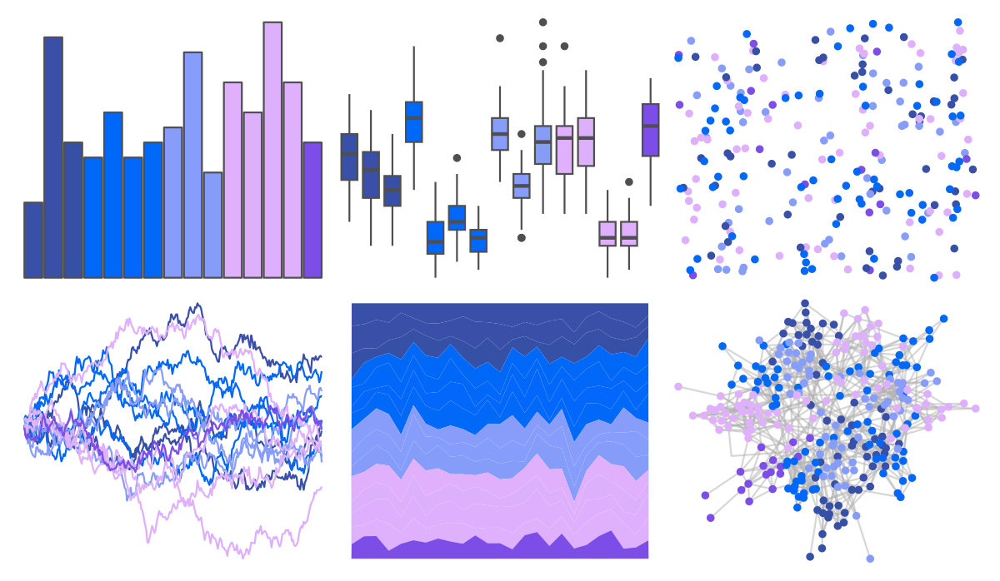
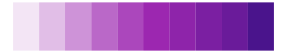

# beyonce - X111 

::: columns
::: {.column width="50%"}

**Github**

[dill/beyonce](https://github.com/dill/beyonce)
:::

::: {.column width="50%"}

**CRAN**

Not on CRAN
:::
:::

<hr> 

Use with [paletteer](https://emilhvitfeldt.github.io/paletteer/) package:

```r
library(paletteer)
paletteer_d("beyonce::X111")
```

Use raw:

```r
c("#3850A8FF", "#3A4FA8FF", "#3650A5FF", "#0068F7FF", "#0068F8FF", "#0367FBFF", "#0069F7FF", "#889DFAFF", "#869DFBFF", "#859CF9FF", "#E0B0FCFF", "#DCB0FBFF", "#DEAFFDFF", "#DFB1FCFF", "#7C4DE7FF")
``` 

 

<br>

# Related Palettes

<div class="list" style="display: grid; grid-template-columns: auto auto auto;"> <figure class="figure">
<a href="../../awtools/a_palette/"> </a>
</figure> <figure class="figure">
<a href="../../ggthemes/excel_Violet_II/"> </a>
</figure> <figure class="figure">
<a href="../../ggprism/pastels/"> </a>
</figure> <figure class="figure">
<a href="../../ggsci/deep_purple_material/"> </a>
</figure> <figure class="figure">
<a href="../../ggsci/purple_material/"> </a>
</figure> <figure class="figure">
<a href="../../ggprism/the_blues/"> </a>
</figure> <figure class="figure">
<a href="../../rcartocolor/Purp/"> </a>
</figure> <figure class="figure">
<a href="../../ggsci/indigo_material/"> </a>
</figure> <figure class="figure">
<a href="../../Redmonder/qMSOPu2/"> </a>
</figure> <figure class="figure">
<a href="../../ggsci/blue_material/"> </a>
</figure> <figure class="figure">
<a href="../../colRoz/sky/"> </a>
</figure> <figure class="figure">
<a href="../../ggthemes/excel_Red_Violet/"> </a>
</figure> 
</div>
