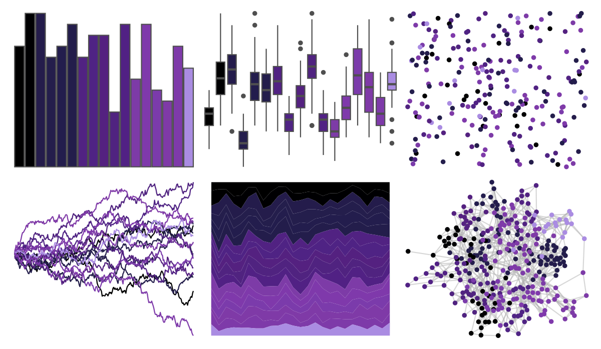
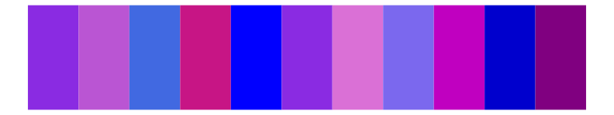
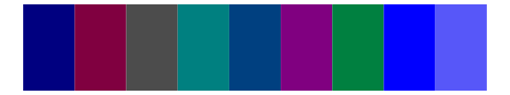

# beyonce - X112 

::: columns
::: {.column width="50%"}

**Github**

[dill/beyonce](https://github.com/dill/beyonce)
:::

::: {.column width="50%"}

**CRAN**

Not on CRAN
:::
:::

<hr> 

Use with [paletteer](https://emilhvitfeldt.github.io/paletteer/) package:

```r
library(paletteer)
paletteer_d("beyonce::X112")
```

Use raw:

```r
c("#000000FF", "#000002FF", "#241C4BFF", "#241E4CFF", "#231D4DFF", "#231D4BFF", "#512282FF", "#4F2384FF", "#542180FF", "#502380FF", "#512184FF", "#7D3BA7FF", "#7F39ABFF", "#7B3BABFF", "#7F3AA7FF", "#7E3AA9FF", "#AA8CE2FF")
``` 

 

<br>

# Related Palettes

<div class="list" style="display: grid; grid-template-columns: auto auto auto;"> <figure class="figure">
<a href="../../awtools/a_palette/"> </a>
</figure> <figure class="figure">
<a href="../../beyonce/X98/"> </a>
</figure> <figure class="figure">
<a href="../../beyonce/X31/"> </a>
</figure> <figure class="figure">
<a href="../../beyonce/X68/"> </a>
</figure> <figure class="figure">
<a href="../../beyonce/X13/"> </a>
</figure> <figure class="figure">
<a href="../../miscpalettes/berry/"> </a>
</figure> <figure class="figure">
<a href="../../beyonce/X120/"> </a>
</figure> <figure class="figure">
<a href="../../fishualize/Acanthurus_chirurgus/"> </a>
</figure> <figure class="figure">
<a href="../../beyonce/X15/"> </a>
</figure> <figure class="figure">
<a href="../../ggprism/office/"> </a>
</figure> <figure class="figure">
<a href="../../palettesForR/Cool/"> </a>
</figure> <figure class="figure">
<a href="../../ghibli/KikiDark/"> </a>
</figure> 
</div>
