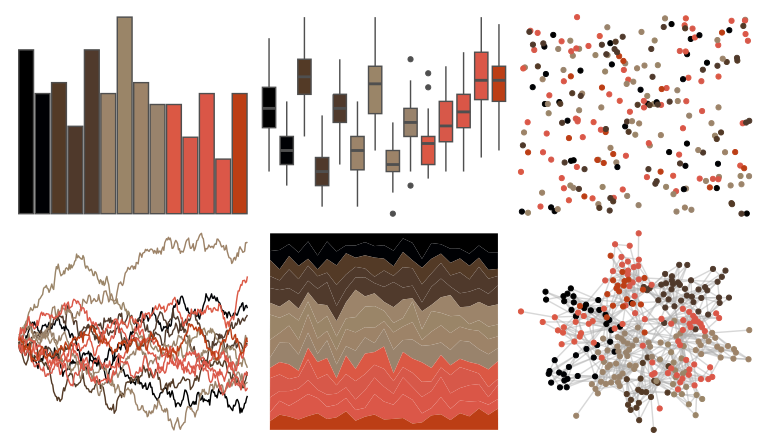

# beyonce - X113 

::: columns
::: {.column width="50%"}

**Github**

[dill/beyonce](https://github.com/dill/beyonce)
:::

::: {.column width="50%"}

**CRAN**

Not on CRAN
:::
:::

<hr> 

Use with [paletteer](https://emilhvitfeldt.github.io/paletteer/) package:

```r
library(paletteer)
paletteer_d("beyonce::X113")
```

Use raw:

```r
c("#000000FF", "#000104FF", "#533A26FF", "#4F392BFF", "#503A2CFF", "#9C846AFF", "#9A8568FF", "#9D8368FF", "#99836CFF", "#DB5844FF", "#D75849FF", "#DA5647FF", "#DB5748FF", "#BC3E15FF")
``` 

 

<br>

# Related Palettes

<div class="list" style="display: grid; grid-template-columns: auto auto auto;"> <figure class="figure">
<a href="../../awtools/a_palette/"> </a>
</figure> <figure class="figure">
<a href="../../beyonce/X81/"> </a>
</figure> <figure class="figure">
<a href="../../ggprism/greenwash/"> </a>
</figure> <figure class="figure">
<a href="../../beyonce/X70/"> </a>
</figure> <figure class="figure">
<a href="../../beyonce/X102/"> </a>
</figure> <figure class="figure">
<a href="../../beyonce/X89/"> </a>
</figure> <figure class="figure">
<a href="../../tvthemes/Rutile/"> </a>
</figure> <figure class="figure">
<a href="../../fishualize/Labrisomus_cricota/"> </a>
</figure> <figure class="figure">
<a href="../../beyonce/X69/"> </a>
</figure> <figure class="figure">
<a href="../../nbapalettes/jazz_city/"> </a>
</figure> <figure class="figure">
<a href="../../peRReo/don/"> </a>
</figure> <figure class="figure">
<a href="../../beyonce/X100/"> </a>
</figure> 
</div>
