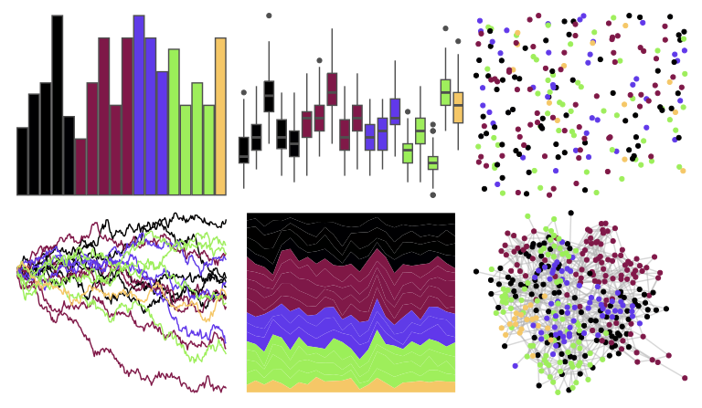

# beyonce - X114 

::: columns
::: {.column width="50%"}

**Github**

[dill/beyonce](https://github.com/dill/beyonce)
:::

::: {.column width="50%"}

**CRAN**

Not on CRAN
:::
:::

<hr> 

Use with [paletteer](https://emilhvitfeldt.github.io/paletteer/) package:

```r
library(paletteer)
paletteer_d("beyonce::X114")
```

Use raw:

```r
c("#000000FF", "#000002FF", "#010000FF", "#000100FF", "#000004FF", "#7F1845FF", "#821849FF", "#7E1848FF", "#801948FF", "#801849FF", "#5F3BE7FF", "#5F3AE9FF", "#6138EAFF", "#9BEF59FF", "#9EED5CFF", "#9EEE5BFF", "#9FEF5CFF", "#F5C767FF")
``` 

 

<br>

# Related Palettes

<div class="list" style="display: grid; grid-template-columns: auto auto auto;"> <figure class="figure">
<a href="../../awtools/a_palette/"> </a>
</figure> <figure class="figure">
<a href="../../colorBlindness/paletteMartin/"> </a>
</figure> <figure class="figure">
<a href="../../beyonce/X96/"> </a>
</figure> <figure class="figure">
<a href="../../pals/tol/"> </a>
</figure> <figure class="figure">
<a href="../../peRReo/ozuna/"> </a>
</figure> <figure class="figure">
<a href="../../palettesForR/Paintjet/"> </a>
</figure> <figure class="figure">
<a href="../../awtools/bpalette/"> </a>
</figure> <figure class="figure">
<a href="../../palettetown/seviper/"> </a>
</figure> <figure class="figure">
<a href="../../palettetown/roselia/"> </a>
</figure> <figure class="figure">
<a href="../../nbapalettes/suns_city/"> </a>
</figure> <figure class="figure">
<a href="../../beyonce/X64/"> </a>
</figure> <figure class="figure">
<a href="../../nbapalettes/nuggets_city2/"> </a>
</figure> 
</div>
