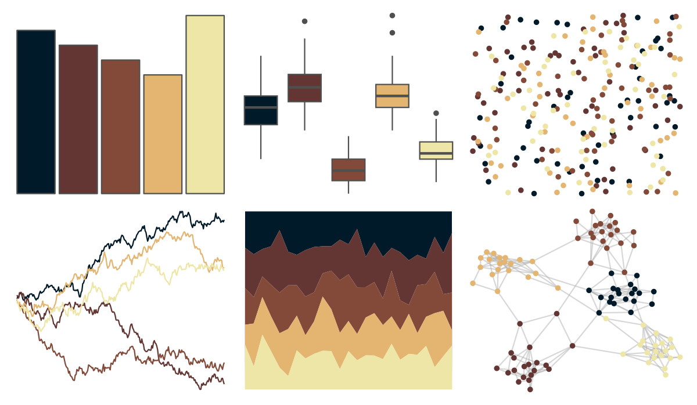

# beyonce - X115 

::: columns
::: {.column width="50%"}

**Github**

[dill/beyonce](https://github.com/dill/beyonce)
:::

::: {.column width="50%"}

**CRAN**

Not on CRAN
:::
:::

<hr> 

Use with [paletteer](https://emilhvitfeldt.github.io/paletteer/) package:

```r
library(paletteer)
paletteer_d("beyonce::X115")
```

Use raw:

```r
c("#001A29FF", "#633633FF", "#834A39FF", "#E3B571FF", "#EEE6A6FF")
``` 

 

<br>

# Related Palettes

<div class="list" style="display: grid; grid-template-columns: auto auto auto;"> <figure class="figure">
<a href="../../amerika/Dem_Ind_Rep3/"> </a>
</figure> <figure class="figure">
<a href="../../MetBrewer/Navajo/"> </a>
</figure> <figure class="figure">
<a href="../../lisa/JohannesVermeer_1/"> </a>
</figure> <figure class="figure">
<a href="../../ltc/heatmap/"> </a>
</figure> <figure class="figure">
<a href="../../colRoz/desert_dusk/"> </a>
</figure> <figure class="figure">
<a href="../../jcolors/pal4/"> </a>
</figure> <figure class="figure">
<a href="../../nbapalettes/grizzlies_europe/"> </a>
</figure> <figure class="figure">
<a href="../../nationalparkcolors/Hawaii/"> </a>
</figure> <figure class="figure">
<a href="../../beyonce/X30/"> </a>
</figure> <figure class="figure">
<a href="../../jcolors/pal7/"> </a>
</figure> <figure class="figure">
<a href="../../ghibli/MarnieMedium1/"> </a>
</figure> <figure class="figure">
<a href="../../lisa/GiorgiodeChirico/"> </a>
</figure> 
</div>
