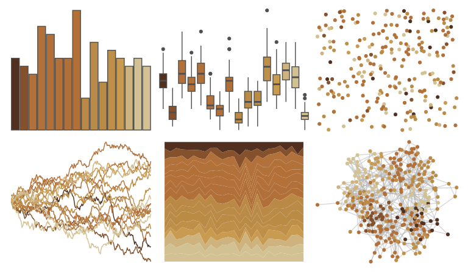

# beyonce - X117 

::: columns
::: {.column width="50%"}

**Github**

[dill/beyonce](https://github.com/dill/beyonce)
:::

::: {.column width="50%"}

**CRAN**

Not on CRAN
:::
:::

<hr> 

Use with [paletteer](https://emilhvitfeldt.github.io/paletteer/) package:

```r
library(paletteer)
paletteer_d("beyonce::X117")
```

Use raw:

```r
c("#51301FFF", "#85512CFF", "#B2713BFF", "#B27139FF", "#B26F38FF", "#B37039FF", "#B1703AFF", "#B17038FF", "#BA8946FF", "#BA8B47FF", "#BA8B45FF", "#BE8F49FF", "#C99B50FF", "#CEB37EFF", "#D2C193FF", "#D3C193FF")
``` 

 

<br>

# Related Palettes

<div class="list" style="display: grid; grid-template-columns: auto auto auto;"> <figure class="figure">
<a href="../../awtools/a_palette/"> </a>
</figure> <figure class="figure">
<a href="../../impressionist.colors/paysage_tropical_avec_masureset_palmiers/"> </a>
</figure> <figure class="figure">
<a href="../../beyonce/X69/"> </a>
</figure> <figure class="figure">
<a href="../../palettetown/spinda/"> </a>
</figure> <figure class="figure">
<a href="../../beyonce/X59/"> </a>
</figure> <figure class="figure">
<a href="../../beyonce/X86/"> </a>
</figure> <figure class="figure">
<a href="../../ggprism/beer_and_ales/"> </a>
</figure> <figure class="figure">
<a href="../../IslamicArt/fes/"> </a>
</figure> <figure class="figure">
<a href="../../palettetown/marowak/"> </a>
</figure> <figure class="figure">
<a href="../../palettetown/lunatone/"> </a>
</figure> <figure class="figure">
<a href="../../MetBrewer/OKeeffe2/"> </a>
</figure> <figure class="figure">
<a href="../../nord/moose_pond/"> </a>
</figure> 
</div>
