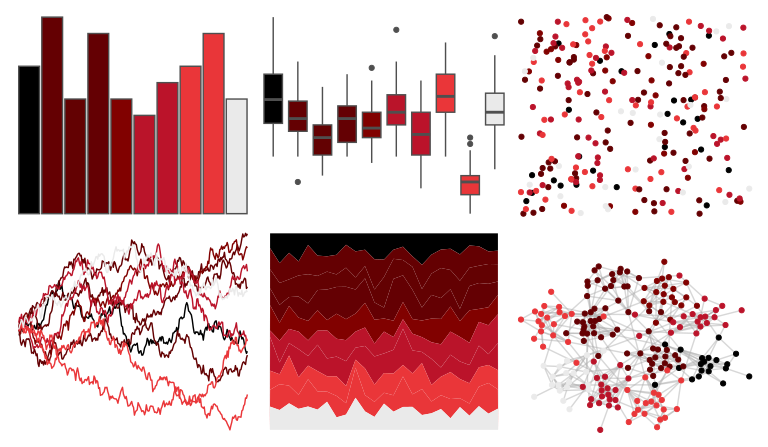

# beyonce - X118 

::: columns
::: {.column width="50%"}

**Github**

[dill/beyonce](https://github.com/dill/beyonce)
:::

::: {.column width="50%"}

**CRAN**

Not on CRAN
:::
:::

<hr> 

Use with [paletteer](https://emilhvitfeldt.github.io/paletteer/) package:

```r
library(paletteer)
paletteer_d("beyonce::X118")
```

Use raw:

```r
c("#000000FF", "#640002FF", "#630102FF", "#640003FF", "#810100FF", "#BA142AFF", "#BB132AFF", "#EA3639FF", "#E93639FF", "#EAEAEAFF")
``` 

 

<br>

# Related Palettes

<div class="list" style="display: grid; grid-template-columns: auto auto auto;"> <figure class="figure">
<a href="../../awtools/a_palette/"> </a>
</figure> <figure class="figure">
<a href="../../beyonce/X100/"> </a>
</figure> <figure class="figure">
<a href="../../beyonce/X71/"> </a>
</figure> <figure class="figure">
<a href="../../fishualize/Exallias_brevis/"> </a>
</figure> <figure class="figure">
<a href="../../beyonce/X123/"> </a>
</figure> <figure class="figure">
<a href="../../beyonce/X67/"> </a>
</figure> <figure class="figure">
<a href="../../beyonce/X107/"> </a>
</figure> <figure class="figure">
<a href="../../dutchmasters/staalmeesters/"> </a>
</figure> <figure class="figure">
<a href="../../peRReo/don/"> </a>
</figure> <figure class="figure">
<a href="../../tayloRswift/taylorRed/"> </a>
</figure> <figure class="figure">
<a href="../../tvthemes/Sardonyx/"> </a>
</figure> <figure class="figure">
<a href="../../futurevisions/titan/"> </a>
</figure> 
</div>
