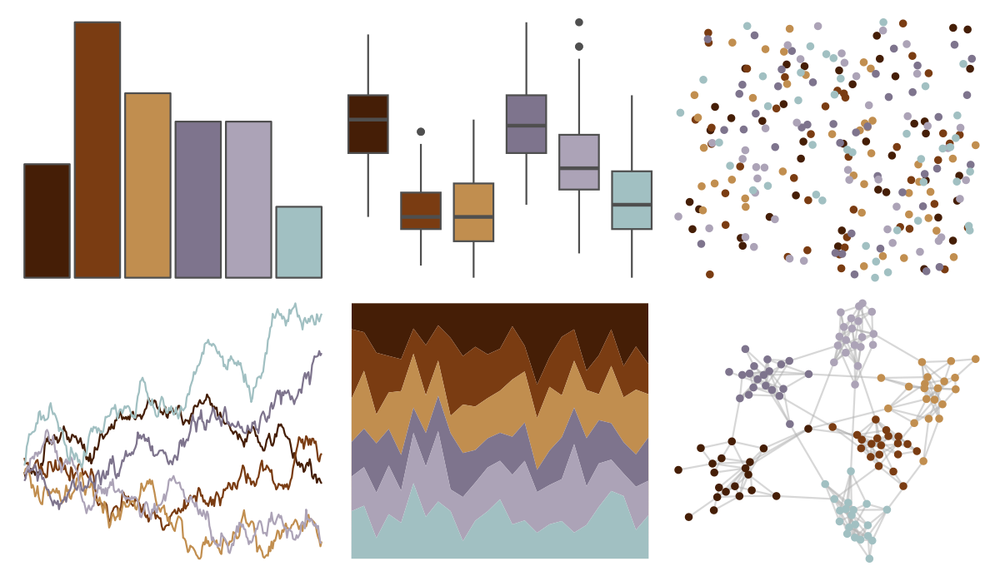

# beyonce - X12 

::: columns
::: {.column width="50%"}

**Github**

[dill/beyonce](https://github.com/dill/beyonce)
:::

::: {.column width="50%"}

**CRAN**

Not on CRAN
:::
:::

<hr> 

Use with [paletteer](https://emilhvitfeldt.github.io/paletteer/) package:

```r
library(paletteer)
paletteer_d("beyonce::X12")
```

Use raw:

```r
c("#451E06FF", "#7A3C12FF", "#C18E4FFF", "#7E748DFF", "#ACA3B7FF", "#A1C0C2FF")
``` 

 

<br>

# Related Palettes

<div class="list" style="display: grid; grid-template-columns: auto auto auto;"> <figure class="figure">
<a href="../../amerika/Dem_Ind_Rep3/"> </a>
</figure> <figure class="figure">
<a href="../../ghibli/KikiMedium/"> </a>
</figure> <figure class="figure">
<a href="../../nationalparkcolors/Denali/"> </a>
</figure> <figure class="figure">
<a href="../../tayloRswift/AquamarineGreen1989/"> </a>
</figure> <figure class="figure">
<a href="../../ghibli/SpiritedMedium/"> </a>
</figure> <figure class="figure">
<a href="../../rockthemes/harvey/"> </a>
</figure> <figure class="figure">
<a href="../../NatParksPalettes/KingsCanyon/"> </a>
</figure> <figure class="figure">
<a href="../../nbapalettes/thunder_city/"> </a>
</figure> <figure class="figure">
<a href="../../colRoz/e_kingii/"> </a>
</figure> <figure class="figure">
<a href="../../beyonce/X128/"> </a>
</figure> <figure class="figure">
<a href="../../IslamicArt/alhambra/"> </a>
</figure> <figure class="figure">
<a href="../../colRoz/salt_lake/"> </a>
</figure> 
</div>
