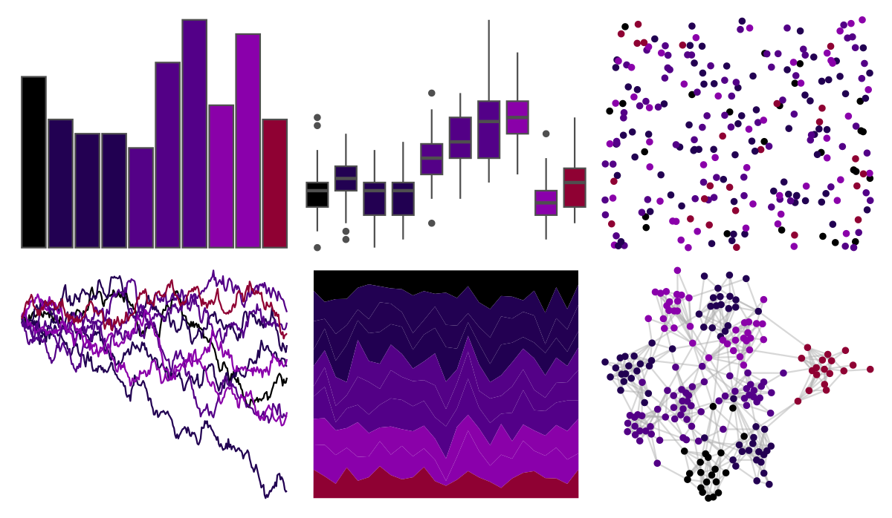

# beyonce - X120 

::: columns
::: {.column width="50%"}

**Github**

[dill/beyonce](https://github.com/dill/beyonce)
:::

::: {.column width="50%"}

**CRAN**

Not on CRAN
:::
:::

<hr> 

Use with [paletteer](https://emilhvitfeldt.github.io/paletteer/) package:

```r
library(paletteer)
paletteer_d("beyonce::X120")
```

Use raw:

```r
c("#000000FF", "#220152FF", "#230052FF", "#210051FF", "#540187FF", "#530086FF", "#530088FF", "#8A01A9FF", "#8A00ABFF", "#8F0133FF")
``` 

 

<br>

# Related Palettes

<div class="list" style="display: grid; grid-template-columns: auto auto auto;"> <figure class="figure">
<a href="../../amerika/Dem_Ind_Rep3/"> </a>
</figure> <figure class="figure">
<a href="../../PrettyCols/Velvet/"> </a>
</figure> <figure class="figure">
<a href="../../beyonce/X91/"> </a>
</figure> <figure class="figure">
<a href="../../beyonce/X98/"> </a>
</figure> <figure class="figure">
<a href="../../beyonce/X112/"> </a>
</figure> <figure class="figure">
<a href="../../ButterflyColors/chorinea_licursis/"> </a>
</figure> <figure class="figure">
<a href="../../beyonce/X31/"> </a>
</figure> <figure class="figure">
<a href="../../PrettyCols/Purples/"> </a>
</figure> <figure class="figure">
<a href="../../futurevisions/trappest/"> </a>
</figure> <figure class="figure">
<a href="../../miscpalettes/berry/"> </a>
</figure> <figure class="figure">
<a href="../../ghibli/KikiDark/"> </a>
</figure> <figure class="figure">
<a href="../../beyonce/X13/"> </a>
</figure> 
</div>
