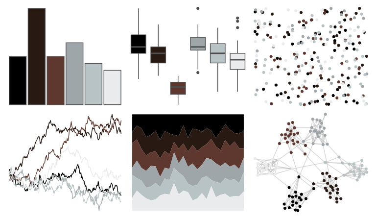

# beyonce - X122 

::: columns
::: {.column width="50%"}

**Github**

[dill/beyonce](https://github.com/dill/beyonce)
:::

::: {.column width="50%"}

**CRAN**

Not on CRAN
:::
:::

<hr> 

Use with [paletteer](https://emilhvitfeldt.github.io/paletteer/) package:

```r
library(paletteer)
paletteer_d("beyonce::X122")
```

Use raw:

```r
c("#000000FF", "#281913FF", "#5E382EFF", "#9EA6A9FF", "#B8C3C5FF", "#EAEBEDFF")
``` 

 

<br>

# Related Palettes

<div class="list" style="display: grid; grid-template-columns: auto auto auto;"> <figure class="figure">
<a href="../../awtools/a_palette/"> </a>
</figure> <figure class="figure">
<a href="../../NatParksPalettes/CapitolReef/"> </a>
</figure> <figure class="figure">
<a href="../../beyonce/X128/"> </a>
</figure> <figure class="figure">
<a href="../../beyonce/X125/"> </a>
</figure> <figure class="figure">
<a href="../../colRoz/kimberley/"> </a>
</figure> <figure class="figure">
<a href="../../fishualize/Sander_lucioperca/"> </a>
</figure> <figure class="figure">
<a href="../../tvthemes/Night/"> </a>
</figure> <figure class="figure">
<a href="../../beyonce/X7/"> </a>
</figure> <figure class="figure">
<a href="../../beyonce/X10/"> </a>
</figure> <figure class="figure">
<a href="../../futurevisions/pso/"> </a>
</figure> <figure class="figure">
<a href="../../tayloRswift/reputation/"> </a>
</figure> <figure class="figure">
<a href="../../ghibli/SpiritedMedium/"> </a>
</figure> 
</div>
