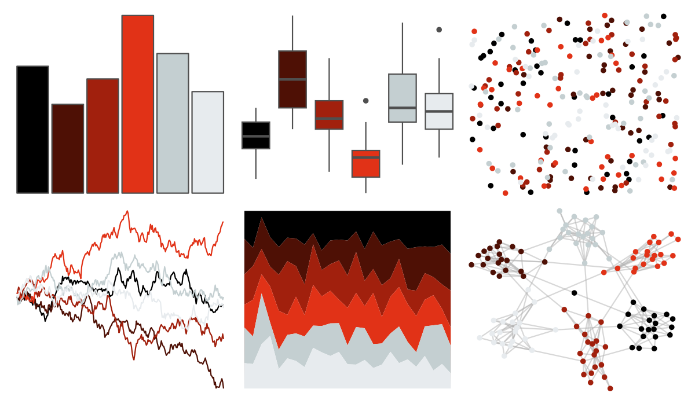

# beyonce - X123 

::: columns
::: {.column width="50%"}

**Github**

[dill/beyonce](https://github.com/dill/beyonce)
:::

::: {.column width="50%"}

**CRAN**

Not on CRAN
:::
:::

<hr> 

Use with [paletteer](https://emilhvitfeldt.github.io/paletteer/) package:

```r
library(paletteer)
paletteer_d("beyonce::X123")
```

Use raw:

```r
c("#000000FF", "#4E1005FF", "#A1200DFF", "#E13217FF", "#C4CFD1FF", "#E7EBEEFF")
``` 

 

<br>

# Related Palettes

<div class="list" style="display: grid; grid-template-columns: auto auto auto;"> <figure class="figure">
<a href="../../amerika/Dem_Ind_Rep3/"> </a>
</figure> <figure class="figure">
<a href="../../fishualize/Lutjanus_sebae/"> </a>
</figure> <figure class="figure">
<a href="../../beyonce/X46/"> </a>
</figure> <figure class="figure">
<a href="../../fishualize/Exallias_brevis/"> </a>
</figure> <figure class="figure">
<a href="../../soilpalettes/alaquod/"> </a>
</figure> <figure class="figure">
<a href="../../lisa/AndyWarhol_2/"> </a>
</figure> <figure class="figure">
<a href="../../lisa/LorserFeitelson/"> </a>
</figure> <figure class="figure">
<a href="../../beyonce/X30/"> </a>
</figure> <figure class="figure">
<a href="../../poisonfrogs/Olehmanni/"> </a>
</figure> <figure class="figure">
<a href="../../tayloRswift/Red/"> </a>
</figure> <figure class="figure">
<a href="../../peRReo/shakira/"> </a>
</figure> <figure class="figure">
<a href="../../beyonce/X92/"> </a>
</figure> 
</div>
