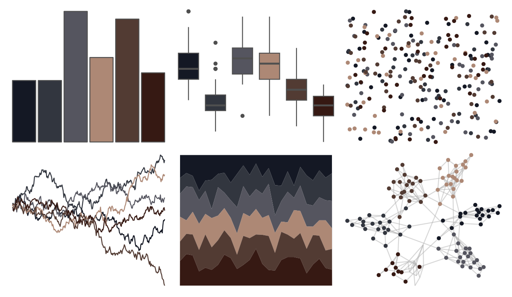

# beyonce - X124 

::: columns
::: {.column width="50%"}

**Github**

[dill/beyonce](https://github.com/dill/beyonce)
:::

::: {.column width="50%"}

**CRAN**

Not on CRAN
:::
:::

<hr> 

Use with [paletteer](https://emilhvitfeldt.github.io/paletteer/) package:

```r
library(paletteer)
paletteer_d("beyonce::X124")
```

Use raw:

```r
c("#141824FF", "#32363FFF", "#55555FFF", "#AD8875FF", "#523B33FF", "#361913FF")
``` 

 

<br>

# Related Palettes

<div class="list" style="display: grid; grid-template-columns: auto auto auto;"> <figure class="figure">
<a href="../../amerika/Dem_Ind_Rep3/"> </a>
</figure> <figure class="figure">
<a href="../../ghibli/PonyoDark/"> </a>
</figure> <figure class="figure">
<a href="../../lisa/AmedeoModigliani/"> </a>
</figure> <figure class="figure">
<a href="../../colRoz/d_novae/"> </a>
</figure> <figure class="figure">
<a href="../../ggprism/pearl/"> </a>
</figure> <figure class="figure">
<a href="../../beyonce/X53/"> </a>
</figure> <figure class="figure">
<a href="../../ghibli/TotoroMedium/"> </a>
</figure> <figure class="figure">
<a href="../../beyonce/X84/"> </a>
</figure> <figure class="figure">
<a href="../../PrettyCols/Aubergines/"> </a>
</figure> <figure class="figure">
<a href="../../beyonce/X1/"> </a>
</figure> <figure class="figure">
<a href="../../ghibli/MononokeDark/"> </a>
</figure> <figure class="figure">
<a href="../../ghibli/SpiritedDark/"> </a>
</figure> 
</div>
