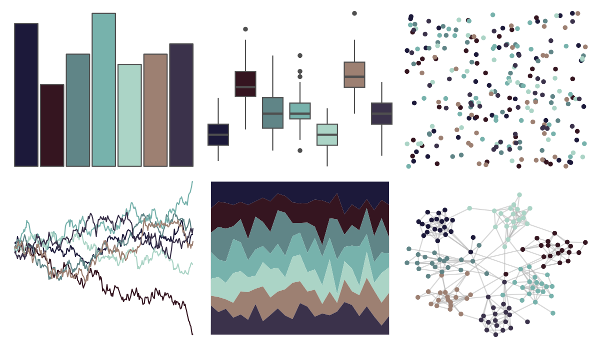

# beyonce - X125 

::: columns
::: {.column width="50%"}

**Github**

[dill/beyonce](https://github.com/dill/beyonce)
:::

::: {.column width="50%"}

**CRAN**

Not on CRAN
:::
:::

<hr> 

Use with [paletteer](https://emilhvitfeldt.github.io/paletteer/) package:

```r
library(paletteer)
paletteer_d("beyonce::X125")
```

Use raw:

```r
c("#1C193AFF", "#351520FF", "#608587FF", "#77B2ACFF", "#ABD4C6FF", "#9D8072FF", "#3B324BFF")
``` 

 

<br>

# Related Palettes

<div class="list" style="display: grid; grid-template-columns: auto auto auto;"> <figure class="figure">
<a href="../../amerika/Dem_Ind_Rep3/"> </a>
</figure> <figure class="figure">
<a href="../../ghibli/SpiritedMedium/"> </a>
</figure> <figure class="figure">
<a href="../../colRoz/salt_lake/"> </a>
</figure> <figure class="figure">
<a href="../../NatParksPalettes/CapitolReef/"> </a>
</figure> <figure class="figure">
<a href="../../MexBrewer/Frida/"> </a>
</figure> <figure class="figure">
<a href="../../calecopal/tidepool/"> </a>
</figure> <figure class="figure">
<a href="../../MetBrewer/Cassatt2/"> </a>
</figure> <figure class="figure">
<a href="../../lisa/GeorgiaOKeeffe/"> </a>
</figure> <figure class="figure">
<a href="../../rtist/okeeffe/"> </a>
</figure> <figure class="figure">
<a href="../../beyonce/X6/"> </a>
</figure> <figure class="figure">
<a href="../../tvthemes/Night/"> </a>
</figure> <figure class="figure">
<a href="../../beyonce/X128/"> </a>
</figure> 
</div>
