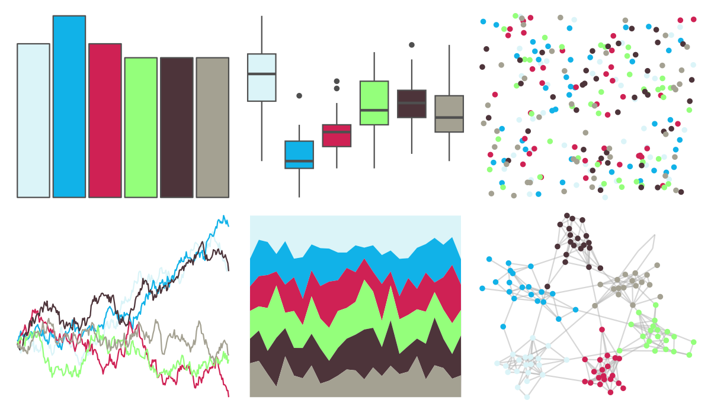

# beyonce - X127 

::: columns
::: {.column width="50%"}

**Github**

[dill/beyonce](https://github.com/dill/beyonce)
:::

::: {.column width="50%"}

**CRAN**

Not on CRAN
:::
:::

<hr> 

Use with [paletteer](https://emilhvitfeldt.github.io/paletteer/) package:

```r
library(paletteer)
paletteer_d("beyonce::X127")
```

Use raw:

```r
c("#DBF4F8FF", "#11B2E8FF", "#CF2154FF", "#94FF7BFF", "#4D343AFF", "#A4A192FF")
``` 

 

<br>

# Related Palettes

<div class="list" style="display: grid; grid-template-columns: auto auto auto;"> <figure class="figure">
<a href="../../awtools/a_palette/"> </a>
</figure> <figure class="figure">
<a href="../../khroma/bright/"> </a>
</figure> <figure class="figure">
<a href="../../RColorBrewer/Accent/"> </a>
</figure> <figure class="figure">
<a href="../../lisa/JacksonPollock/"> </a>
</figure> <figure class="figure">
<a href="../../rtist/pollock/"> </a>
</figure> <figure class="figure">
<a href="../../feathers/eastern_rosella/"> </a>
</figure> <figure class="figure">
<a href="../../ggthemr/grass/"> </a>
</figure> <figure class="figure">
<a href="../../tayloRswift/speakNowLive/"> </a>
</figure> <figure class="figure">
<a href="../../fishualize/Ostorhinchus_angustatus/"> </a>
</figure> <figure class="figure">
<a href="../../tayloRswift/lover/"> </a>
</figure> <figure class="figure">
<a href="../../tvthemes/rickAndMorty/"> </a>
</figure> <figure class="figure">
<a href="../../peRReo/calle13/"> </a>
</figure> 
</div>
