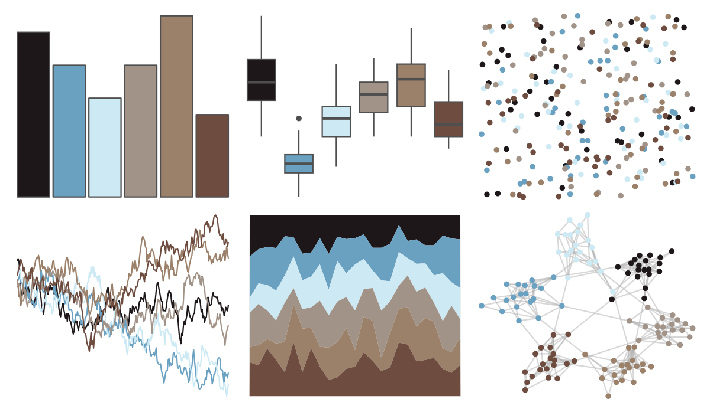
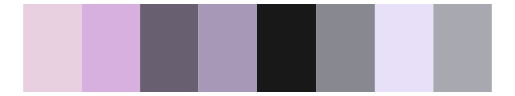

# beyonce - X128 

::: columns
::: {.column width="50%"}

**Github**

[dill/beyonce](https://github.com/dill/beyonce)
:::

::: {.column width="50%"}

**CRAN**

Not on CRAN
:::
:::

<hr> 

Use with [paletteer](https://emilhvitfeldt.github.io/paletteer/) package:

```r
library(paletteer)
paletteer_d("beyonce::X128")
```

Use raw:

```r
c("#1D1719FF", "#6AA1C1FF", "#CDEAF4FF", "#A19388FF", "#9B816AFF", "#6E4C40FF")
``` 

 

<br>

# Related Palettes

<div class="list" style="display: grid; grid-template-columns: auto auto auto;"> <figure class="figure">
<a href="../../awtools/a_palette/"> </a>
</figure> <figure class="figure">
<a href="../../ghibli/SpiritedMedium/"> </a>
</figure> <figure class="figure">
<a href="../../fishualize/Sander_lucioperca/"> </a>
</figure> <figure class="figure">
<a href="../../colRoz/e_kingii/"> </a>
</figure> <figure class="figure">
<a href="../../beyonce/X12/"> </a>
</figure> <figure class="figure">
<a href="../../palettetown/cascoon/"> </a>
</figure> <figure class="figure">
<a href="../../ggprism/pearl2/"> </a>
</figure> <figure class="figure">
<a href="../../fishualize/Semicossyphus_pulcher/"> </a>
</figure> <figure class="figure">
<a href="../../NatParksPalettes/CapitolReef/"> </a>
</figure> <figure class="figure">
<a href="../../beyonce/X56/"> </a>
</figure> <figure class="figure">
<a href="../../beyonce/X10/"> </a>
</figure> <figure class="figure">
<a href="../../wesanderson/IsleofDogs2/"> </a>
</figure> 
</div>
