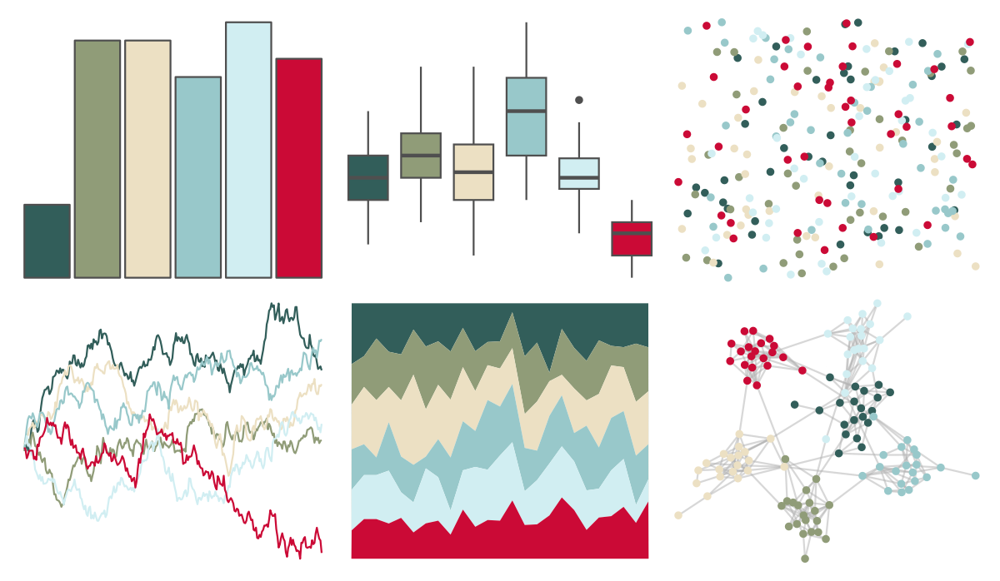

# beyonce - X129 

::: columns
::: {.column width="50%"}

**Github**

[dill/beyonce](https://github.com/dill/beyonce)
:::

::: {.column width="50%"}

**CRAN**

Not on CRAN
:::
:::

<hr> 

Use with [paletteer](https://emilhvitfeldt.github.io/paletteer/) package:

```r
library(paletteer)
paletteer_d("beyonce::X129")
```

Use raw:

```r
c("#325E5AFF", "#909C78FF", "#ECE0C3FF", "#98C8CAFF", "#D1EEF2FF", "#CB0A36FF")
``` 

 

<br>

# Related Palettes

<div class="list" style="display: grid; grid-template-columns: auto auto auto;"> <figure class="figure">
<a href="../../awtools/a_palette/"> </a>
</figure> <figure class="figure">
<a href="../../ButterflyColors/hamadryas_feronia/"> </a>
</figure> <figure class="figure">
<a href="../../ButterflyColors/hamadryas_feronia/"> </a>
</figure> <figure class="figure">
<a href="../../rcartocolor/TealRose/"> </a>
</figure> <figure class="figure">
<a href="../../nationalparkcolors/MtRainier/"> </a>
</figure> <figure class="figure">
<a href="../../ltc/gaby/"> </a>
</figure> <figure class="figure">
<a href="../../vangogh/SelfPortrait/"> </a>
</figure> <figure class="figure">
<a href="../../beyonce/X9/"> </a>
</figure> <figure class="figure">
<a href="../../NineteenEightyR/miami2/"> </a>
</figure> <figure class="figure">
<a href="../../waRhol/marilyn_green_62/"> </a>
</figure> <figure class="figure">
<a href="../../beyonce/X35/"> </a>
</figure> <figure class="figure">
<a href="../../MoMAColors/Lupi/"> </a>
</figure> 
</div>
