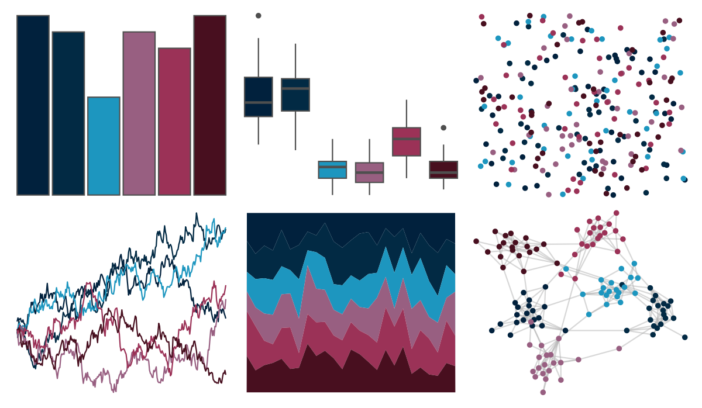

# beyonce - X13 

::: columns
::: {.column width="50%"}

**Github**

[dill/beyonce](https://github.com/dill/beyonce)
:::

::: {.column width="50%"}

**CRAN**

Not on CRAN
:::
:::

<hr> 

Use with [paletteer](https://emilhvitfeldt.github.io/paletteer/) package:

```r
library(paletteer)
paletteer_d("beyonce::X13")
```

Use raw:

```r
c("#01213DFF", "#022A44FF", "#1D96BFFF", "#985F81FF", "#9B3257FF", "#480F1FFF")
``` 

 

<br>

# Related Palettes

<div class="list" style="display: grid; grid-template-columns: auto auto auto;"> <figure class="figure">
<a href="../../awtools/a_palette/"> </a>
</figure> <figure class="figure">
<a href="../../beyonce/X31/"> </a>
</figure> <figure class="figure">
<a href="../../beyonce/X15/"> </a>
</figure> <figure class="figure">
<a href="../../beyonce/X68/"> </a>
</figure> <figure class="figure">
<a href="../../beyonce/X25/"> </a>
</figure> <figure class="figure">
<a href="../../beyonce/X106/"> </a>
</figure> <figure class="figure">
<a href="../../fishualize/Acanthurus_chirurgus/"> </a>
</figure> <figure class="figure">
<a href="../../futurevisions/trappest/"> </a>
</figure> <figure class="figure">
<a href="../../ghibli/KikiDark/"> </a>
</figure> <figure class="figure">
<a href="../../yarrr/eternal/"> </a>
</figure> <figure class="figure">
<a href="../../MetBrewer/Troy/"> </a>
</figure> <figure class="figure">
<a href="../../beyonce/X37/"> </a>
</figure> 
</div>
