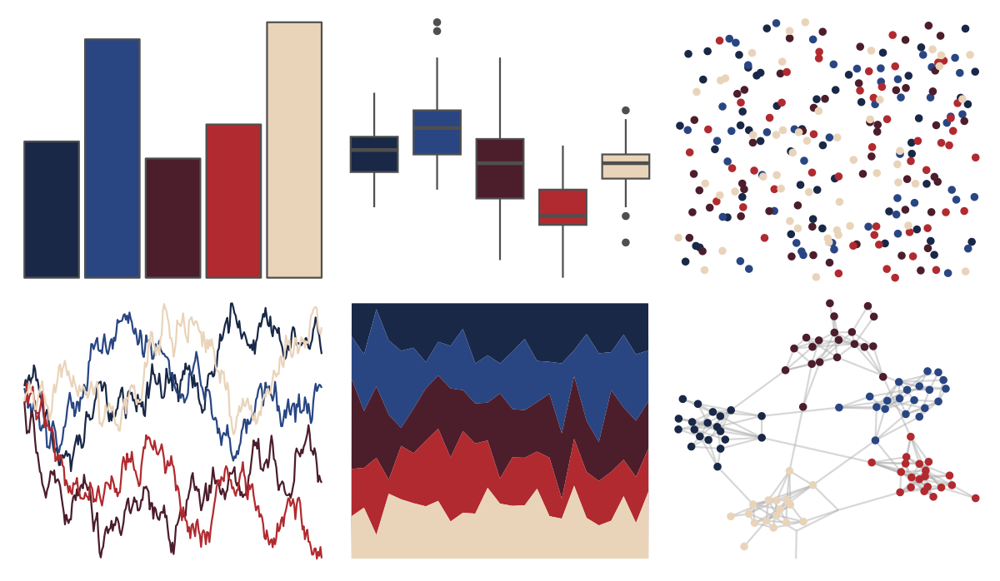

# beyonce - X130 

::: columns
::: {.column width="50%"}

**Github**

[dill/beyonce](https://github.com/dill/beyonce)
:::

::: {.column width="50%"}

**CRAN**

Not on CRAN
:::
:::

<hr> 

Use with [paletteer](https://emilhvitfeldt.github.io/paletteer/) package:

```r
library(paletteer)
paletteer_d("beyonce::X130")
```

Use raw:

```r
c("#192847FF", "#294683FF", "#4C1D2BFF", "#B12A2FFF", "#E9D4BAFF")
``` 

 

<br>

# Related Palettes

<div class="list" style="display: grid; grid-template-columns: auto auto auto;"> <figure class="figure">
<a href="../../amerika/Dem_Ind_Rep3/"> </a>
</figure> <figure class="figure">
<a href="../../beyonce/X41/"> </a>
</figure> <figure class="figure">
<a href="../../beyonce/X30/"> </a>
</figure> <figure class="figure">
<a href="../../rtist/vermeer/"> </a>
</figure> <figure class="figure">
<a href="../../futurevisions/enceladus/"> </a>
</figure> <figure class="figure">
<a href="../../NatParksPalettes/Volcanoes/"> </a>
</figure> <figure class="figure">
<a href="../../DresdenColor/briefcases/"> </a>
</figure> <figure class="figure">
<a href="../../nbapalettes/pistons/"> </a>
</figure> <figure class="figure">
<a href="../../nbapalettes/pistons_city/"> </a>
</figure> <figure class="figure">
<a href="../../beyonce/X38/"> </a>
</figure> <figure class="figure">
<a href="../../Manu/Takahe/"> </a>
</figure> <figure class="figure">
<a href="../../MetBrewer/Thomas/"> </a>
</figure> 
</div>
