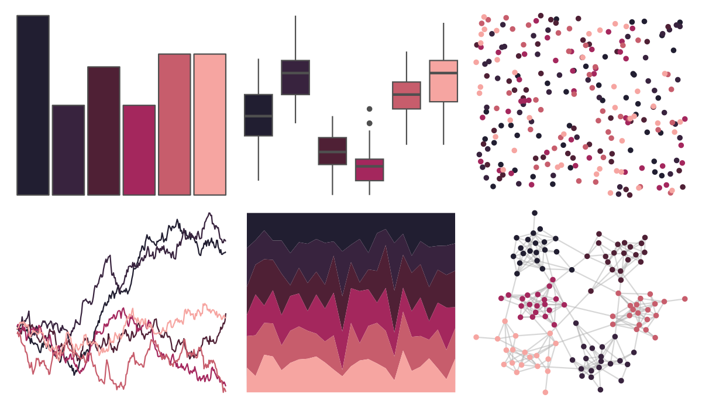

# beyonce - X14 

::: columns
::: {.column width="50%"}

**Github**

[dill/beyonce](https://github.com/dill/beyonce)
:::

::: {.column width="50%"}

**CRAN**

Not on CRAN
:::
:::

<hr> 

Use with [paletteer](https://emilhvitfeldt.github.io/paletteer/) package:

```r
library(paletteer)
paletteer_d("beyonce::X14")
```

Use raw:

```r
c("#211E31FF", "#38233EFF", "#4F2035FF", "#A4275DFF", "#C75D6CFF", "#F6A5A1FF")
``` 

 

<br>

# Related Palettes

<div class="list" style="display: grid; grid-template-columns: auto auto auto;"> <figure class="figure">
<a href="../../awtools/a_palette/"> </a>
</figure> <figure class="figure">
<a href="../../beyonce/X26/"> </a>
</figure> <figure class="figure">
<a href="../../beyonce/X27/"> </a>
</figure> <figure class="figure">
<a href="../../unikn/pal_bordeaux/"> </a>
</figure> <figure class="figure">
<a href="../../MapPalettes/bruiser/"> </a>
</figure> <figure class="figure">
<a href="../../peRReo/ivyqueen/"> </a>
</figure> <figure class="figure">
<a href="../../rcartocolor/Burg/"> </a>
</figure> <figure class="figure">
<a href="../../calecopal/vermillion/"> </a>
</figure> <figure class="figure">
<a href="../../NineteenEightyR/cobra/"> </a>
</figure> <figure class="figure">
<a href="../../vapeplot/sunset/"> </a>
</figure> <figure class="figure">
<a href="../../rcartocolor/Magenta/"> </a>
</figure> <figure class="figure">
<a href="../../vapoRwave/sunSet/"> </a>
</figure> 
</div>
