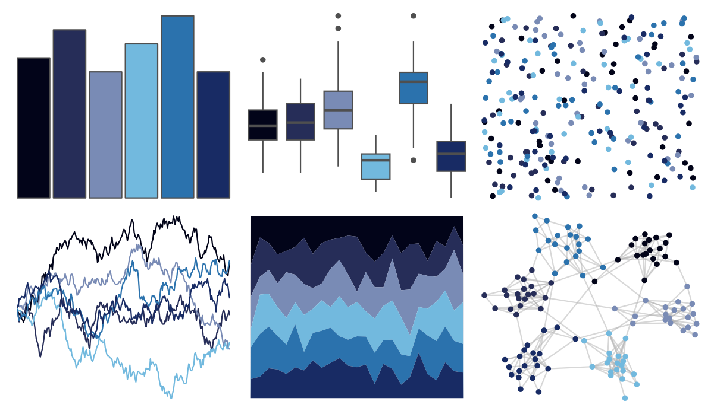

# beyonce - X15 

::: columns
::: {.column width="50%"}

**Github**

[dill/beyonce](https://github.com/dill/beyonce)
:::

::: {.column width="50%"}

**CRAN**

Not on CRAN
:::
:::

<hr> 

Use with [paletteer](https://emilhvitfeldt.github.io/paletteer/) package:

```r
library(paletteer)
paletteer_d("beyonce::X15")
```

Use raw:

```r
c("#020419FF", "#262D58FF", "#798BB5FF", "#72B9DEFF", "#2B72ADFF", "#182B64FF")
``` 

 

<br>

# Related Palettes

<div class="list" style="display: grid; grid-template-columns: auto auto auto;"> <figure class="figure">
<a href="../../awtools/a_palette/"> </a>
</figure> <figure class="figure">
<a href="../../ButterflyColors/hamadryas_feronia/"> </a>
</figure> <figure class="figure">
<a href="../../ButterflyColors/hamadryas_feronia/"> </a>
</figure> <figure class="figure">
<a href="../../fishualize/Acanthurus_chirurgus/"> </a>
</figure> <figure class="figure">
<a href="../../calecopal/sbchannel/"> </a>
</figure> <figure class="figure">
<a href="../../colRoz/physalia/"> </a>
</figure> <figure class="figure">
<a href="../../yarrr/eternal/"> </a>
</figure> <figure class="figure">
<a href="../../beyonce/X13/"> </a>
</figure> <figure class="figure">
<a href="../../colRoz/m_cyaneus/"> </a>
</figure> <figure class="figure">
<a href="../../beyonce/X31/"> </a>
</figure> <figure class="figure">
<a href="../../colRoz/sky/"> </a>
</figure> <figure class="figure">
<a href="../../MoMAColors/Doughton/"> </a>
</figure> 
</div>
