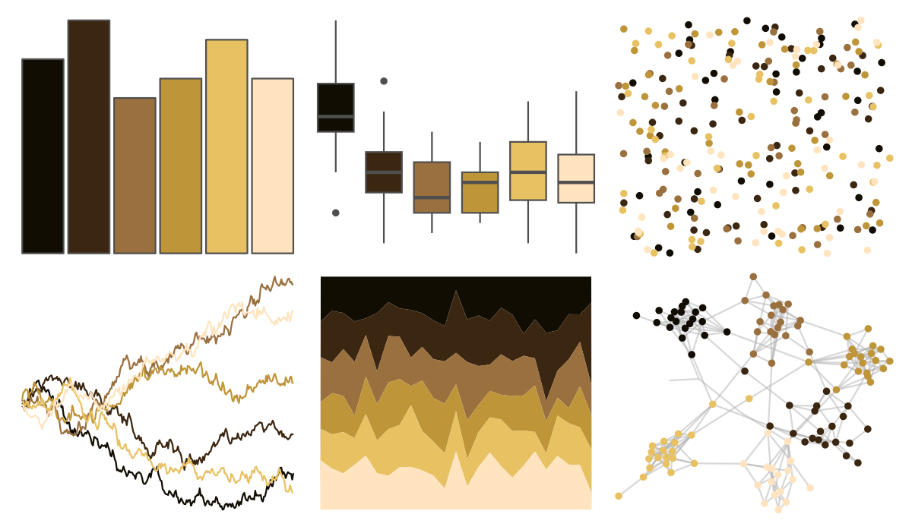
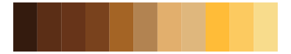

# beyonce - X16 

::: columns
::: {.column width="50%"}

**Github**

[dill/beyonce](https://github.com/dill/beyonce)
:::

::: {.column width="50%"}

**CRAN**

Not on CRAN
:::
:::

<hr> 

Use with [paletteer](https://emilhvitfeldt.github.io/paletteer/) package:

```r
library(paletteer)
paletteer_d("beyonce::X16")
```

Use raw:

```r
c("#110D03FF", "#3B2611FF", "#9A703FFF", "#BF9539FF", "#E8C163FF", "#FFE4BFFF")
``` 

 

<br>

# Related Palettes

<div class="list" style="display: grid; grid-template-columns: auto auto auto;"> <figure class="figure">
<a href="../../amerika/Dem_Ind_Rep3/"> </a>
</figure> <figure class="figure">
<a href="../../colRoz/a_plagiata/"> </a>
</figure> <figure class="figure">
<a href="../../soilpalettes/natrudoll/"> </a>
</figure> <figure class="figure">
<a href="../../colRoz/a_ramsayi/"> </a>
</figure> <figure class="figure">
<a href="../../poisonfrogs/Rmarina/"> </a>
</figure> <figure class="figure">
<a href="../../soilpalettes/durorthod/"> </a>
</figure> <figure class="figure">
<a href="../../poisonfrogs/Afemoralis/"> </a>
</figure> <figure class="figure">
<a href="../../colRoz/a_westwoodi/"> </a>
</figure> <figure class="figure">
<a href="../../poisonfrogs/Oslita/"> </a>
</figure> <figure class="figure">
<a href="../../beyonce/X86/"> </a>
</figure> <figure class="figure">
<a href="../../poisonfrogs/Ribanded/"> </a>
</figure> <figure class="figure">
<a href="../../poisonfrogs/Oscolon/"> </a>
</figure> 
</div>
