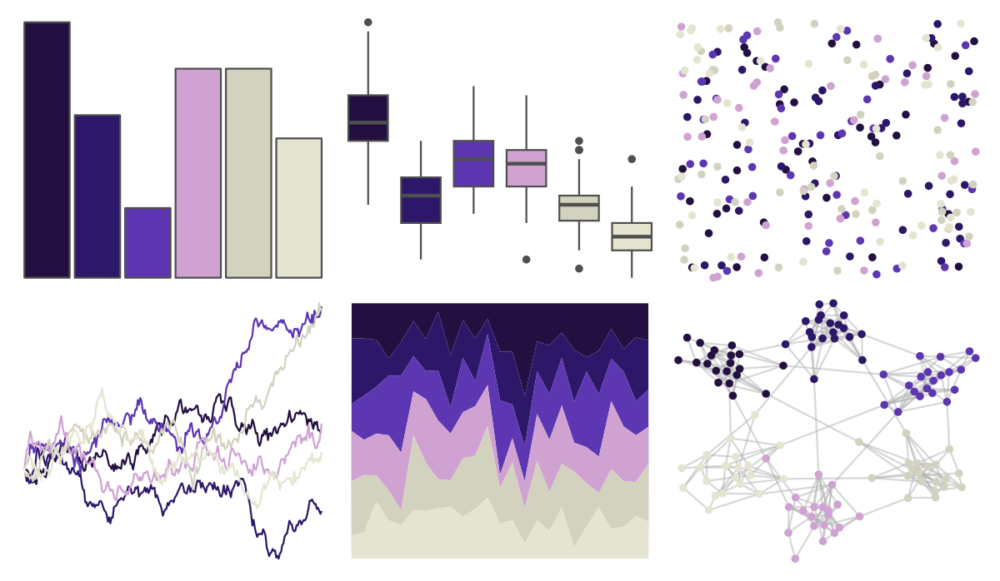

# beyonce - X17 

::: columns
::: {.column width="50%"}

**Github**

[dill/beyonce](https://github.com/dill/beyonce)
:::

::: {.column width="50%"}

**CRAN**

Not on CRAN
:::
:::

<hr> 

Use with [paletteer](https://emilhvitfeldt.github.io/paletteer/) package:

```r
library(paletteer)
paletteer_d("beyonce::X17")
```

Use raw:

```r
c("#231040FF", "#2C1769FF", "#5D36B1FF", "#CFA2D2FF", "#D3D2BFFF", "#E5E4D0FF")
``` 

 

<br>

# Related Palettes

<div class="list" style="display: grid; grid-template-columns: auto auto auto;"> <figure class="figure">
<a href="../../awtools/a_palette/"> </a>
</figure> <figure class="figure">
<a href="../../beyonce/X7/"> </a>
</figure> <figure class="figure">
<a href="../../ghibli/LaputaMedium/"> </a>
</figure> <figure class="figure">
<a href="../../lisa/YvesKlein/"> </a>
</figure> <figure class="figure">
<a href="../../lisa/GeorgiaOKeeffe/"> </a>
</figure> <figure class="figure">
<a href="../../rtist/okeeffe/"> </a>
</figure> <figure class="figure">
<a href="../../palettetown/dratini/"> </a>
</figure> <figure class="figure">
<a href="../../DresdenColor/briefcases/"> </a>
</figure> <figure class="figure">
<a href="../../fishualize/Ostracion_whitleyi/"> </a>
</figure> <figure class="figure">
<a href="../../beyonce/X21/"> </a>
</figure> <figure class="figure">
<a href="../../beyonce/X11/"> </a>
</figure> <figure class="figure">
<a href="../../futurevisions/europa/"> </a>
</figure> 
</div>
