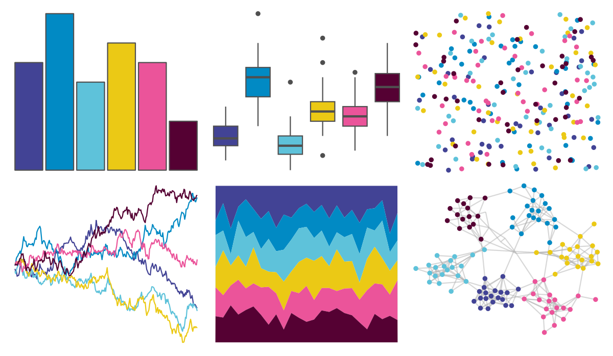

# beyonce - X18 

::: columns
::: {.column width="50%"}

**Github**

[dill/beyonce](https://github.com/dill/beyonce)
:::

::: {.column width="50%"}

**CRAN**

Not on CRAN
:::
:::

<hr> 

Use with [paletteer](https://emilhvitfeldt.github.io/paletteer/) package:

```r
library(paletteer)
paletteer_d("beyonce::X18")
```

Use raw:

```r
c("#424395FF", "#018AC4FF", "#5EC2DAFF", "#EBC915FF", "#EB549AFF", "#550133FF")
``` 

 

<br>

# Related Palettes

<div class="list" style="display: grid; grid-template-columns: auto auto auto;"> <figure class="figure">
<a href="../../amerika/Dem_Ind_Rep3/"> </a>
</figure> <figure class="figure">
<a href="../../MetBrewer/Austria/"> </a>
</figure> <figure class="figure">
<a href="../../LaCroixColoR/PassionFruit/"> </a>
</figure> <figure class="figure">
<a href="../../vapoRwave/hyperBubble/"> </a>
</figure> <figure class="figure">
<a href="../../pals/tol/"> </a>
</figure> <figure class="figure">
<a href="../../khroma/muted/"> </a>
</figure> <figure class="figure">
<a href="../../tvthemes/Steven/"> </a>
</figure> <figure class="figure">
<a href="../../tvthemes/Alexandrite/"> </a>
</figure> <figure class="figure">
<a href="../../PrettyCols/Oasis/"> </a>
</figure> <figure class="figure">
<a href="../../DresdenColor/briefcases/"> </a>
</figure> <figure class="figure">
<a href="../../fishualize/Acanthurus_olivaceus/"> </a>
</figure> <figure class="figure">
<a href="../../PrettyCols/Bold/"> </a>
</figure> 
</div>
