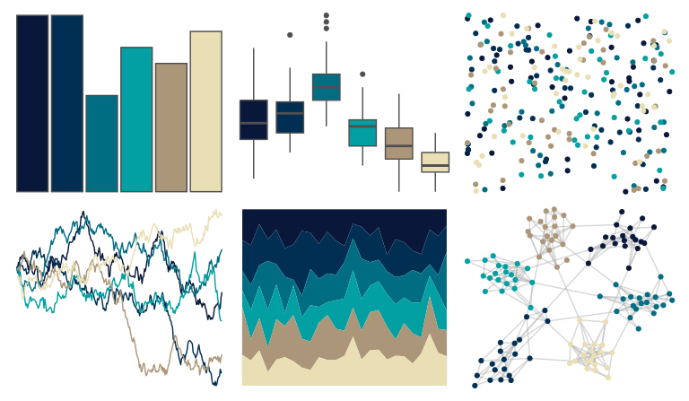

# beyonce - X19 

::: columns
::: {.column width="50%"}

**Github**

[dill/beyonce](https://github.com/dill/beyonce)
:::

::: {.column width="50%"}

**CRAN**

Not on CRAN
:::
:::

<hr> 

Use with [paletteer](https://emilhvitfeldt.github.io/paletteer/) package:

```r
library(paletteer)
paletteer_d("beyonce::X19")
```

Use raw:

```r
c("#08173AFF", "#012F53FF", "#016D83FF", "#02A0A2FF", "#AC9679FF", "#E9DEB4FF")
``` 

 

<br>

# Related Palettes

<div class="list" style="display: grid; grid-template-columns: auto auto auto;"> <figure class="figure">
<a href="../../awtools/a_palette/"> </a>
</figure> <figure class="figure">
<a href="../../ghibli/MarnieMedium1/"> </a>
</figure> <figure class="figure">
<a href="../../nbapalettes/hornets_believe/"> </a>
</figure> <figure class="figure">
<a href="../../beyonce/X40/"> </a>
</figure> <figure class="figure">
<a href="../../beyonce/X33/"> </a>
</figure> <figure class="figure">
<a href="../../colRoz/desert_dusk/"> </a>
</figure> <figure class="figure">
<a href="../../ghibli/YesterdayMedium/"> </a>
</figure> <figure class="figure">
<a href="../../beyonce/X115/"> </a>
</figure> <figure class="figure">
<a href="../../nbapalettes/grizzlies_europe/"> </a>
</figure> <figure class="figure">
<a href="../../LaCroixColoR/Coconut/"> </a>
</figure> <figure class="figure">
<a href="../../severance/TheYouYouAre/"> </a>
</figure> <figure class="figure">
<a href="../../MetBrewer/Manet/"> </a>
</figure> 
</div>
