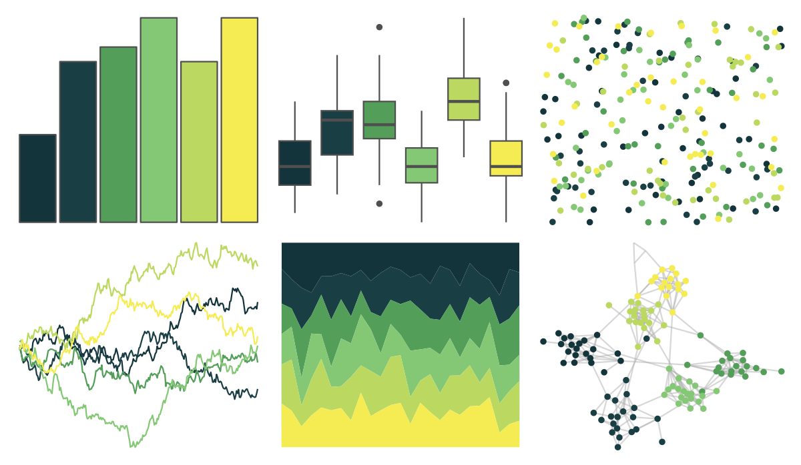

# beyonce - X22 

::: columns
::: {.column width="50%"}

**Github**

[dill/beyonce](https://github.com/dill/beyonce)
:::

::: {.column width="50%"}

**CRAN**

Not on CRAN
:::
:::

<hr> 

Use with [paletteer](https://emilhvitfeldt.github.io/paletteer/) package:

```r
library(paletteer)
paletteer_d("beyonce::X22")
```

Use raw:

```r
c("#12343AFF", "#193E44FF", "#539E59FF", "#84C876FF", "#BBD961FF", "#F5EC54FF")
``` 

 

<br>

# Related Palettes

<div class="list" style="display: grid; grid-template-columns: auto auto auto;"> <figure class="figure">
<a href="../../awtools/a_palette/"> </a>
</figure> <figure class="figure">
<a href="../../ButterflyColors/hamadryas_feronia/"> </a>
</figure> <figure class="figure">
<a href="../../ButterflyColors/hamadryas_feronia/"> </a>
</figure> <figure class="figure">
<a href="../../rcartocolor/ag_GrnYl/"> </a>
</figure> <figure class="figure">
<a href="../../MapPalettes/green_machine/"> </a>
</figure> <figure class="figure">
<a href="../../LaCroixColoR/Lime/"> </a>
</figure> <figure class="figure">
<a href="../../jcolors/pal11/"> </a>
</figure> <figure class="figure">
<a href="../../PNWColors/Cascades/"> </a>
</figure> <figure class="figure">
<a href="../../rcartocolor/Emrld/"> </a>
</figure> <figure class="figure">
<a href="../../ggthemes/excel_Green/"> </a>
</figure> <figure class="figure">
<a href="../../rtist/vangogh/"> </a>
</figure> <figure class="figure">
<a href="../../ghibli/MarnieMedium2/"> </a>
</figure> 
</div>
