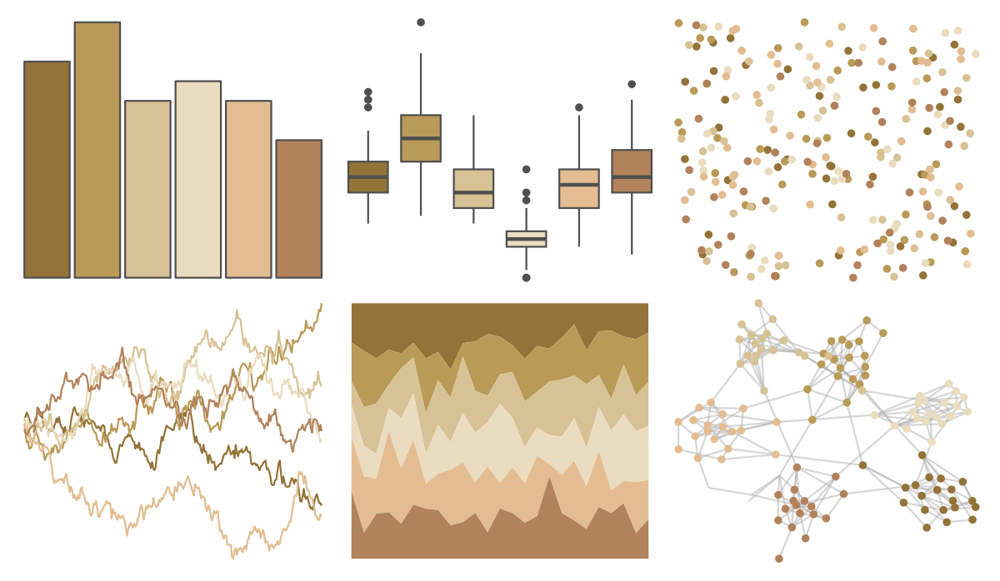

# beyonce - X23 

::: columns
::: {.column width="50%"}

**Github**

[dill/beyonce](https://github.com/dill/beyonce)
:::

::: {.column width="50%"}

**CRAN**

Not on CRAN
:::
:::

<hr> 

Use with [paletteer](https://emilhvitfeldt.github.io/paletteer/) package:

```r
library(paletteer)
paletteer_d("beyonce::X23")
```

Use raw:

```r
c("#937338FF", "#B99A57FF", "#D7C295FF", "#EADCBFFF", "#E3BD91FF", "#B2825BFF")
``` 

 

<br>

# Related Palettes

<div class="list" style="display: grid; grid-template-columns: auto auto auto;"> <figure class="figure">
<a href="../../awtools/a_palette/"> </a>
</figure> <figure class="figure">
<a href="../../ButterflyColors/hamadryas_feronia/"> </a>
</figure> <figure class="figure">
<a href="../../ButterflyColors/hamadryas_feronia/"> </a>
</figure> <figure class="figure">
<a href="../../lisa/AlbrechtDurer/"> </a>
</figure> <figure class="figure">
<a href="../../palettetown/eevee/"> </a>
</figure> <figure class="figure">
<a href="../../Manu/Kakapo/"> </a>
</figure> <figure class="figure">
<a href="../../fishualize/Oncorhynchus_mykiss/"> </a>
</figure> <figure class="figure">
<a href="../../lisa/JohnQuidor/"> </a>
</figure> <figure class="figure">
<a href="../../fishualize/Hypleurochilus_fissicornis/"> </a>
</figure> <figure class="figure">
<a href="../../nbapalettes/spurs/"> </a>
</figure> <figure class="figure">
<a href="../../wesanderson/Royal2/"> </a>
</figure> <figure class="figure">
<a href="../../rcartocolor/Fall/"> </a>
</figure> 
</div>
