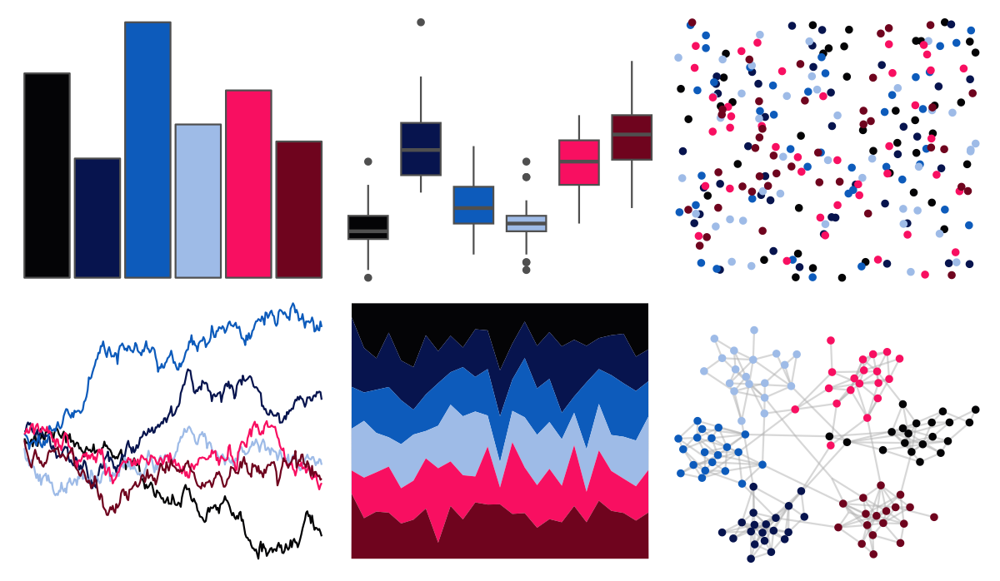

# beyonce - X25 

::: columns
::: {.column width="50%"}

**Github**

[dill/beyonce](https://github.com/dill/beyonce)
:::

::: {.column width="50%"}

**CRAN**

Not on CRAN
:::
:::

<hr> 

Use with [paletteer](https://emilhvitfeldt.github.io/paletteer/) package:

```r
library(paletteer)
paletteer_d("beyonce::X25")
```

Use raw:

```r
c("#040406FF", "#07144EFF", "#0D5BBBFF", "#9EBBE7FF", "#F80F61FF", "#6F041EFF")
``` 

 

<br>

# Related Palettes

<div class="list" style="display: grid; grid-template-columns: auto auto auto;"> <figure class="figure">
<a href="../../awtools/a_palette/"> </a>
</figure> <figure class="figure">
<a href="../../ButterflyColors/hamadryas_feronia/"> </a>
</figure> <figure class="figure">
<a href="../../ButterflyColors/hamadryas_feronia/"> </a>
</figure> <figure class="figure">
<a href="../../ggprism/colorblind_safe/"> </a>
</figure> <figure class="figure">
<a href="../../suffrager/hanwell/"> </a>
</figure> <figure class="figure">
<a href="../../nbapalettes/kings_city/"> </a>
</figure> <figure class="figure">
<a href="../../beyonce/X13/"> </a>
</figure> <figure class="figure">
<a href="../../beyonce/X37/"> </a>
</figure> <figure class="figure">
<a href="../../beyonce/X106/"> </a>
</figure> <figure class="figure">
<a href="../../nbapalettes/hornets_classic/"> </a>
</figure> <figure class="figure">
<a href="../../yarrr/eternal/"> </a>
</figure> <figure class="figure">
<a href="../../nbapalettes/pistons_city/"> </a>
</figure> 
</div>
