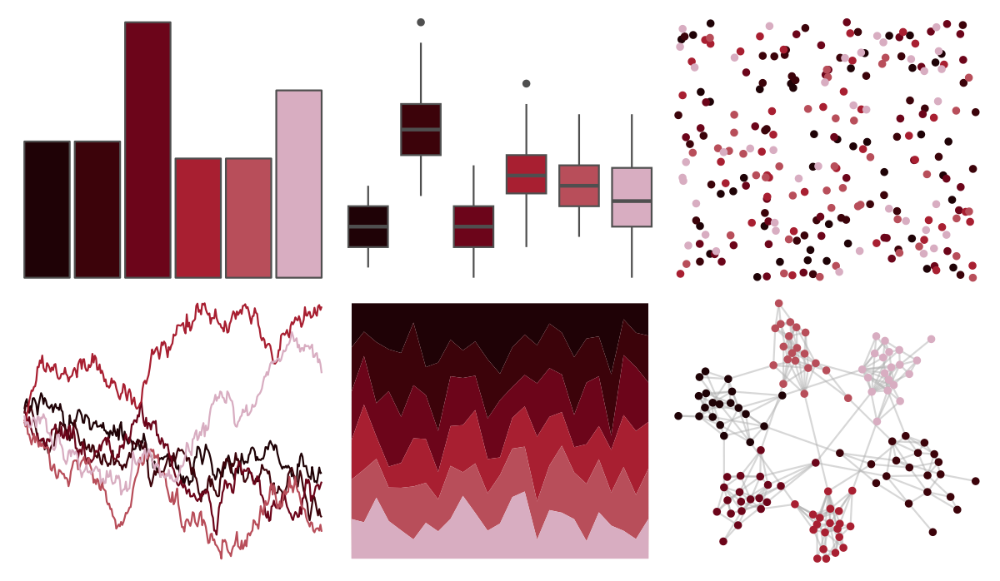

# beyonce - X26 

::: columns
::: {.column width="50%"}

**Github**

[dill/beyonce](https://github.com/dill/beyonce)
:::

::: {.column width="50%"}

**CRAN**

Not on CRAN
:::
:::

<hr> 

Use with [paletteer](https://emilhvitfeldt.github.io/paletteer/) package:

```r
library(paletteer)
paletteer_d("beyonce::X26")
```

Use raw:

```r
c("#1F0206FF", "#3C030AFF", "#6C051AFF", "#A81F31FF", "#B84E5AFF", "#D8ADC1FF")
``` 

 

<br>

# Related Palettes

<div class="list" style="display: grid; grid-template-columns: auto auto auto;"> <figure class="figure">
<a href="../../amerika/Dem_Ind_Rep3/"> </a>
</figure> <figure class="figure">
<a href="../../beyonce/X14/"> </a>
</figure> <figure class="figure">
<a href="../../unikn/pal_bordeaux/"> </a>
</figure> <figure class="figure">
<a href="../../calecopal/vermillion/"> </a>
</figure> <figure class="figure">
<a href="../../vapeplot/sunset/"> </a>
</figure> <figure class="figure">
<a href="../../beyonce/X20/"> </a>
</figure> <figure class="figure">
<a href="../../MoMAColors/Althoff/"> </a>
</figure> <figure class="figure">
<a href="../../beyonce/X8/"> </a>
</figure> <figure class="figure">
<a href="../../nbapalettes/blazers_city2/"> </a>
</figure> <figure class="figure">
<a href="../../vapoRwave/sunSet/"> </a>
</figure> <figure class="figure">
<a href="../../beyonce/X27/"> </a>
</figure> <figure class="figure">
<a href="../../peRReo/ivyqueen/"> </a>
</figure> 
</div>
