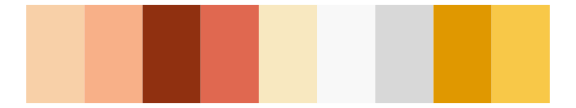

# beyonce - X28 

::: columns
::: {.column width="50%"}

**Github**

[dill/beyonce](https://github.com/dill/beyonce)
:::

::: {.column width="50%"}

**CRAN**

Not on CRAN
:::
:::

<hr> 

Use with [paletteer](https://emilhvitfeldt.github.io/paletteer/) package:

```r
library(paletteer)
paletteer_d("beyonce::X28")
```

Use raw:

```r
c("#82441BFF", "#B45921FF", "#F49D63FF", "#FDC57AFF", "#FEEECFFF", "#F6F6F6FF")
``` 

 

<br>

# Related Palettes

<div class="list" style="display: grid; grid-template-columns: auto auto auto;"> <figure class="figure">
<a href="../../awtools/a_palette/"> </a>
</figure> <figure class="figure">
<a href="../../palettetown/ninetales/"> </a>
</figure> <figure class="figure">
<a href="../../PNWColors/Mushroom/"> </a>
</figure> <figure class="figure">
<a href="../../palettetown/exeggcute/"> </a>
</figure> <figure class="figure">
<a href="../../palettetown/krabby/"> </a>
</figure> <figure class="figure">
<a href="../../palettetown/kingler/"> </a>
</figure> <figure class="figure">
<a href="../../rcartocolor/Fall/"> </a>
</figure> <figure class="figure">
<a href="../../palettetown/lickitung/"> </a>
</figure> <figure class="figure">
<a href="../../miscpalettes/beach/"> </a>
</figure> <figure class="figure">
<a href="../../Redmonder/qMSORdOr/"> </a>
</figure> <figure class="figure">
<a href="../../rcartocolor/Geyser/"> </a>
</figure> <figure class="figure">
<a href="../../palettetown/electabuzz/"> </a>
</figure> 
</div>
