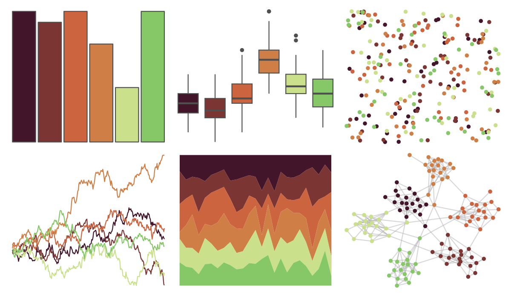

# beyonce - X29 

::: columns
::: {.column width="50%"}

**Github**

[dill/beyonce](https://github.com/dill/beyonce)
:::

::: {.column width="50%"}

**CRAN**

Not on CRAN
:::
:::

<hr> 

Use with [paletteer](https://emilhvitfeldt.github.io/paletteer/) package:

```r
library(paletteer)
paletteer_d("beyonce::X29")
```

Use raw:

```r
c("#43152BFF", "#7B3532FF", "#CC643FFF", "#CF7F46FF", "#CBE08BFF", "#86C767FF")
``` 

 

<br>

# Related Palettes

<div class="list" style="display: grid; grid-template-columns: auto auto auto;"> <figure class="figure">
<a href="../../awtools/a_palette/"> </a>
</figure> <figure class="figure">
<a href="../../ButterflyColors/hamadryas_feronia/"> </a>
</figure> <figure class="figure">
<a href="../../ButterflyColors/hamadryas_feronia/"> </a>
</figure> <figure class="figure">
<a href="../../jcolors/pal7/"> </a>
</figure> <figure class="figure">
<a href="../../lisa/RoyLichtenstein_2/"> </a>
</figure> <figure class="figure">
<a href="../../lisa/GiorgiodeChirico/"> </a>
</figure> <figure class="figure">
<a href="../../vangogh/Eglise/"> </a>
</figure> <figure class="figure">
<a href="../../lisa/FridaKahlo/"> </a>
</figure> <figure class="figure">
<a href="../../calecopal/desert/"> </a>
</figure> <figure class="figure">
<a href="../../beyonce/X115/"> </a>
</figure> <figure class="figure">
<a href="../../nationalparkcolors/Hawaii/"> </a>
</figure> <figure class="figure">
<a href="../../futurevisions/grand_tour/"> </a>
</figure> 
</div>
