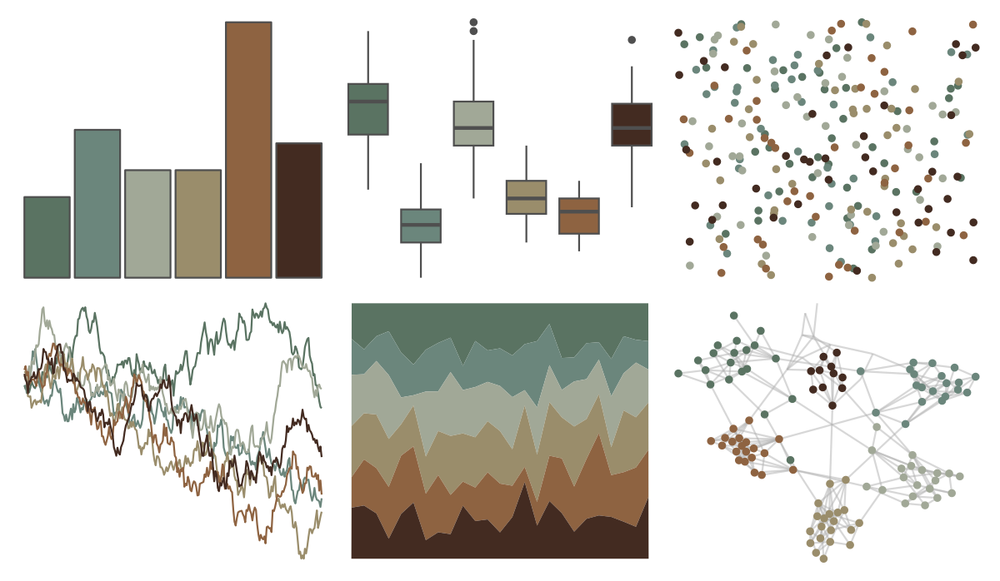

# beyonce - X3 

::: columns
::: {.column width="50%"}

**Github**

[dill/beyonce](https://github.com/dill/beyonce)
:::

::: {.column width="50%"}

**CRAN**

Not on CRAN
:::
:::

<hr> 

Use with [paletteer](https://emilhvitfeldt.github.io/paletteer/) package:

```r
library(paletteer)
paletteer_d("beyonce::X3")
```

Use raw:

```r
c("#5A7362FF", "#6B867CFF", "#A1A897FF", "#9A8D6BFF", "#8E6341FF", "#432B21FF")
``` 

 

<br>

# Related Palettes

<div class="list" style="display: grid; grid-template-columns: auto auto auto;"> <figure class="figure">
<a href="../../amerika/Dem_Ind_Rep3/"> </a>
</figure> <figure class="figure">
<a href="../../fishualize/Lile_piquitinga/"> </a>
</figure> <figure class="figure">
<a href="../../ButterflyColors/dynamine_postverta/"> </a>
</figure> <figure class="figure">
<a href="../../IslamicArt/fes2/"> </a>
</figure> <figure class="figure">
<a href="../../MexBrewer/Taurus2/"> </a>
</figure> <figure class="figure">
<a href="../../colRoz/thylacine/"> </a>
</figure> <figure class="figure">
<a href="../../fishualize/Petromyzon_marinus/"> </a>
</figure> <figure class="figure">
<a href="../../vangogh/Shoes/"> </a>
</figure> <figure class="figure">
<a href="../../Manu/Kiwi/"> </a>
</figure> <figure class="figure">
<a href="../../Rdune/corrino/"> </a>
</figure> <figure class="figure">
<a href="../../lisa/C_M_Coolidge/"> </a>
</figure> <figure class="figure">
<a href="../../lisa/PieterBruegel/"> </a>
</figure> 
</div>
