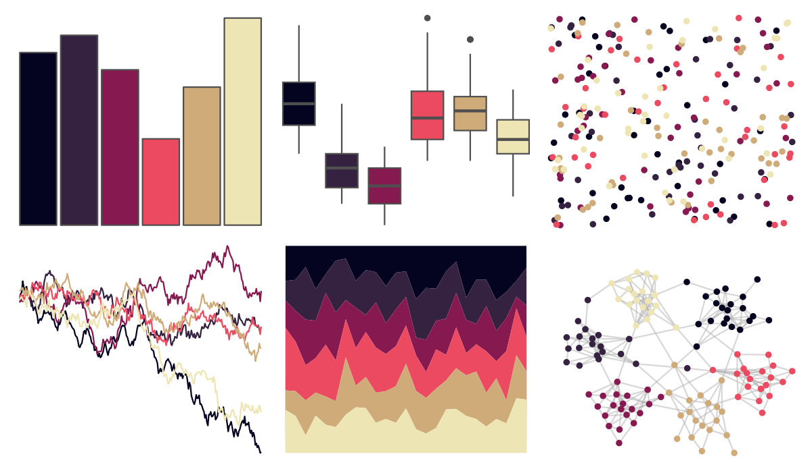

# beyonce - X30 

::: columns
::: {.column width="50%"}

**Github**

[dill/beyonce](https://github.com/dill/beyonce)
:::

::: {.column width="50%"}

**CRAN**

Not on CRAN
:::
:::

<hr> 

Use with [paletteer](https://emilhvitfeldt.github.io/paletteer/) package:

```r
library(paletteer)
paletteer_d("beyonce::X30")
```

Use raw:

```r
c("#040320FF", "#352140FF", "#871951FF", "#EB4A60FF", "#CFAB7AFF", "#EEE5B4FF")
``` 

 

<br>

# Related Palettes

<div class="list" style="display: grid; grid-template-columns: auto auto auto;"> <figure class="figure">
<a href="../../awtools/a_palette/"> </a>
</figure> <figure class="figure">
<a href="../../NatParksPalettes/Volcanoes/"> </a>
</figure> <figure class="figure">
<a href="../../colRoz/desert_dusk/"> </a>
</figure> <figure class="figure">
<a href="../../ggprism/magma/"> </a>
</figure> <figure class="figure">
<a href="../../nationalparkcolors/Hawaii/"> </a>
</figure> <figure class="figure">
<a href="../../beyonce/X115/"> </a>
</figure> <figure class="figure">
<a href="../../tvthemes/Ruby/"> </a>
</figure> <figure class="figure">
<a href="../../jcolors/pal4/"> </a>
</figure> <figure class="figure">
<a href="../../ggprism/inferno/"> </a>
</figure> <figure class="figure">
<a href="../../DresdenColor/briefcases/"> </a>
</figure> <figure class="figure">
<a href="../../nbapalettes/grizzlies_europe/"> </a>
</figure> <figure class="figure">
<a href="../../lisa/AndyWarhol_2/"> </a>
</figure> 
</div>
