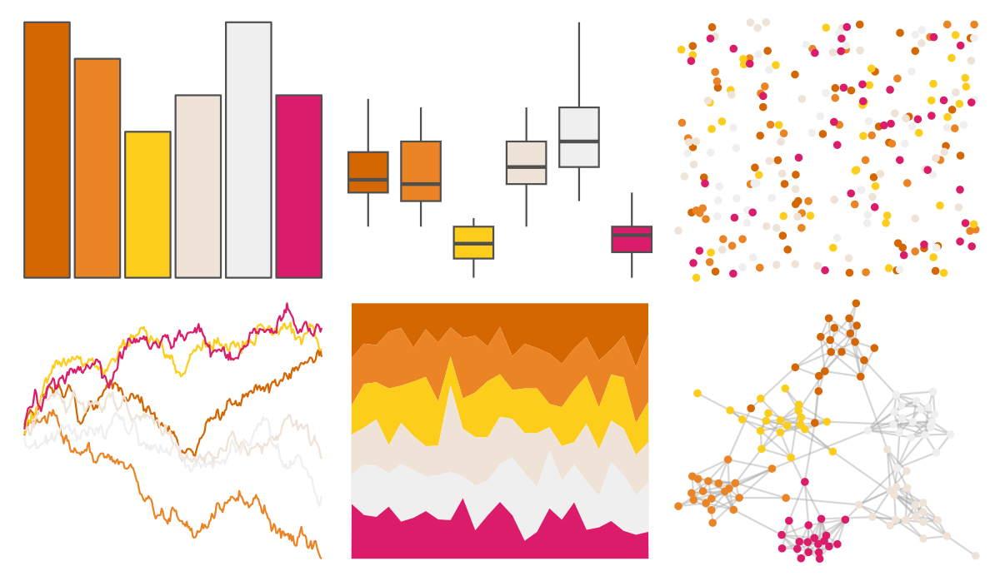
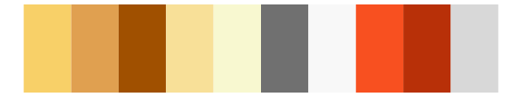

# beyonce - X32 

::: columns
::: {.column width="50%"}

**Github**

[dill/beyonce](https://github.com/dill/beyonce)
:::

::: {.column width="50%"}

**CRAN**

Not on CRAN
:::
:::

<hr> 

Use with [paletteer](https://emilhvitfeldt.github.io/paletteer/) package:

```r
library(paletteer)
paletteer_d("beyonce::X32")
```

Use raw:

```r
c("#D56702FF", "#EA8425FF", "#FCCD1BFF", "#EFE3D7FF", "#EFEFEFFF", "#DB1C6AFF")
``` 

 

<br>

# Related Palettes

<div class="list" style="display: grid; grid-template-columns: auto auto auto;"> <figure class="figure">
<a href="../../amerika/Dem_Ind_Rep3/"> </a>
</figure> <figure class="figure">
<a href="../../vapoRwave/jwz/"> </a>
</figure> <figure class="figure">
<a href="../../palettetown/electabuzz/"> </a>
</figure> <figure class="figure">
<a href="../../palettetown/magby/"> </a>
</figure> <figure class="figure">
<a href="../../colRoz/desert_sunset/"> </a>
</figure> <figure class="figure">
<a href="../../palettetown/slugma/"> </a>
</figure> <figure class="figure">
<a href="../../palettetown/octillery/"> </a>
</figure> <figure class="figure">
<a href="../../Redmonder/qMSOYl/"> </a>
</figure> <figure class="figure">
<a href="../../palettetown/charmeleon/"> </a>
</figure> <figure class="figure">
<a href="../../palettetown/scizor/"> </a>
</figure> <figure class="figure">
<a href="../../colRoz/l_vestiens/"> </a>
</figure> <figure class="figure">
<a href="../../tvthemes/AirNomads/"> </a>
</figure> 
</div>
