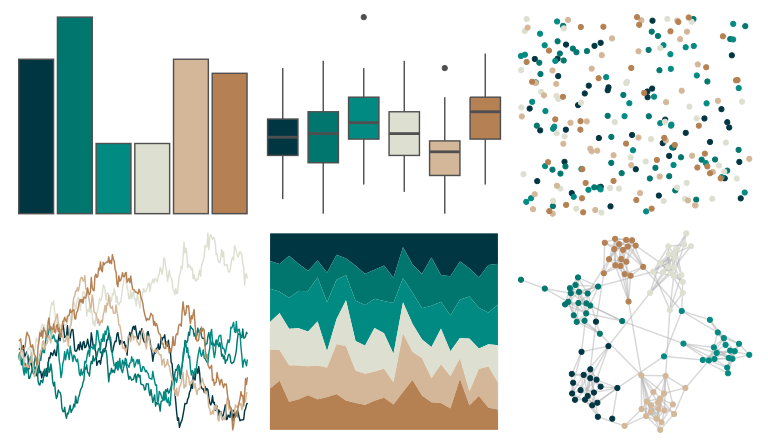

# beyonce - X33 

::: columns
::: {.column width="50%"}

**Github**

[dill/beyonce](https://github.com/dill/beyonce)
:::

::: {.column width="50%"}

**CRAN**

Not on CRAN
:::
:::

<hr> 

Use with [paletteer](https://emilhvitfeldt.github.io/paletteer/) package:

```r
library(paletteer)
paletteer_d("beyonce::X33")
```

Use raw:

```r
c("#003542FF", "#00766EFF", "#008A82FF", "#DDE0D0FF", "#D4B798FF", "#B58052FF")
``` 

 

<br>

# Related Palettes

<div class="list" style="display: grid; grid-template-columns: auto auto auto;"> <figure class="figure">
<a href="../../awtools/a_palette/"> </a>
</figure> <figure class="figure">
<a href="../../ghibli/MarnieMedium1/"> </a>
</figure> <figure class="figure">
<a href="../../beyonce/X40/"> </a>
</figure> <figure class="figure">
<a href="../../MetBrewer/Isfahan1/"> </a>
</figure> <figure class="figure">
<a href="../../ggpomological/pomological_base/"> </a>
</figure> <figure class="figure">
<a href="../../beyonce/X19/"> </a>
</figure> <figure class="figure">
<a href="../../NatParksPalettes/Yellowstone/"> </a>
</figure> <figure class="figure">
<a href="../../lisa/JohannesVermeer_1/"> </a>
</figure> <figure class="figure">
<a href="../../palettetown/starterspairs/"> </a>
</figure> <figure class="figure">
<a href="../../lisa/GiorgiodeChirico_1/"> </a>
</figure> <figure class="figure">
<a href="../../fishualize/Etheostoma_spectabile/"> </a>
</figure> <figure class="figure">
<a href="../../beyonce/X2/"> </a>
</figure> 
</div>
